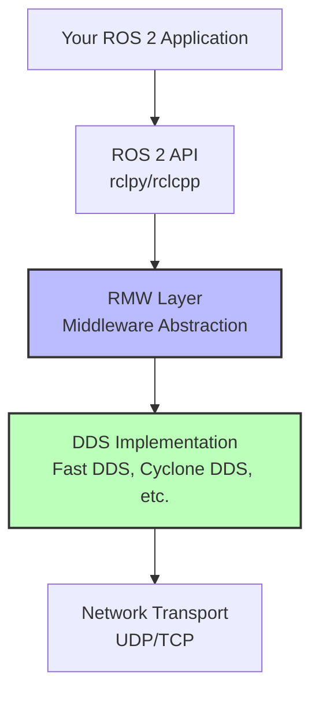

# What is ROS 2?

## Full Lesson

### What is ROS 2?

**ROS 2** (Robot Operating System 2) is a set of software libraries and tools for building robot applications. Despite its name, it's not an operating system like Windows or Linux—it's a **middleware framework** that acts as the "nervous system" for your robot, enabling all components to communicate and coordinate seamlessly.

Think of ROS 2 as a **postal service for robots**. In a city, the postal service lets anyone send messages to anyone else without knowing the details of how delivery works. You just address your letter, drop it in a mailbox, and trust the system to deliver it.

ROS 2 works similarly for robot components:
- **Senders (Publishers)**: Components that generate data (like a camera capturing images)
- **Receivers (Subscribers)**: Components that use data (like an object detection algorithm)
- **Messages**: The data itself (like an image, sensor reading, or command)
- **Post Offices (Topics)**: Named channels where messages are exchanged

**What ROS 2 provides:**

1. **Communication Middleware**: Based on DDS (Data Distribution Service), an industry-standard publish-subscribe protocol
2. **Hardware Abstraction**: Standardized interfaces for sensors and actuators
3. **Device Drivers**: Pre-built packages for common robot hardware
4. **Visualization Tools**: RViz2 for viewing sensor data and robot state
5. **Simulation Integration**: Works with Gazebo, PyBullet, and other simulators
6. **Build Tools**: colcon for compiling and managing multi-package workspaces
7. **Package Ecosystem**: Thousands of open-source packages for navigation, manipulation, perception, etc.

A camera doesn't need to know which components will use its images—it just "publishes" them to a topic called `/camera/image`. Any component interested in camera images can "subscribe" to that topic and receive the data.

This **decoupling** is powerful:
- Add new components without modifying existing ones
- Swap components (e.g., replace a physical camera with a simulated one)
- Run different parts on different machines
- Maintain resilience—if one component fails, others keep running

**Brief History**: ROS 2 is the successor to ROS 1, which was created at Willow Garage in 2007. ROS 1 revolutionized robotics research but had limitations (no real-time support, Linux-only, security gaps). ROS 2, released in 2017, addresses these issues using modern middleware (DDS) and supports industrial applications. ROS 1 reached end-of-life in 2025; all new projects should use ROS 2.

### Why ROS 2 Matters

Imagine you're building a humanoid robot. Your robot needs:
- Cameras to see the world
- Motors to move its joints
- Sensors to maintain balance
- A control system to coordinate movements
- AI algorithms to make decisions

Each component might be developed by different teams, use different programming languages, or run on different computers. How do you get them all to work together? This is where ROS 2 comes in.

**Real-World Applications**:

In the real world, ROS 2 powers:
- **Boston Dynamics' Atlas**: The humanoid robot performing parkour
- **NASA's Valkyrie**: Designed for space exploration
- **Autonomous vehicles**: From delivery robots to self-driving cars
- **Industrial robots**: Manufacturing arms and collaborative robots (cobots)
- **Agricultural robots**: Automated harvesting and crop monitoring
- **Medical robots**: Surgical assistants and rehabilitation devices
- **Service robots**: Warehouse automation, hospitality, security

Without a robust communication framework like ROS 2, building complex robots would be exponentially more difficult. You'd spend more time writing plumbing code than solving robotics problems.

**Advantages over alternatives**:
- **Open Source**: Free to use, modify, and distribute (Apache 2.0 license)
- **Proven at Scale**: Used by thousands of companies and research institutions
- **Active Community**: 8000+ packages, extensive documentation, helpful forums
- **Industry Support**: Backed by major companies (BMW, Bosch, Intel, Microsoft)
- **Standards-Based**: Built on DDS, an OMG standard used in aerospace and military
- **Cross-Platform**: Runs on Linux, Windows, macOS, and even embedded systems

### Core Concepts

ROS 2 is built around a few fundamental concepts that enable distributed robot systems. Understanding these is key to working with ROS 2 effectively.

#### Nodes

A **node** is an independent process that performs a specific computation. Think of nodes as specialized workers in a factory—each has one job and does it well.

**Examples of nodes:**
- A node that reads camera data
- A node that detects objects in images
- A node that controls motor speeds
- A node that plans robot paths
- A node that monitors battery levels

**Key properties:**
- **Independence**: Each node runs as a separate process
- **Single Responsibility**: One node, one task
- **Discoverable**: Nodes automatically find each other on the network
- **Language Agnostic**: Nodes can be written in Python, C++, or other languages

Nodes are the fundamental building blocks of ROS 2 applications. A complex robot system might have dozens or hundreds of nodes running simultaneously. The beauty is that each node can be developed, tested, and debugged independently.

#### Topics and Publish-Subscribe

A **topic** is a named bus over which nodes exchange messages. Topics implement the publish-subscribe pattern, one of the most important concepts in ROS 2.

**The Publish-Subscribe Pattern**:

Imagine a newspaper subscription:
- **Publishers** (newspapers) create content and send it out
- **Subscribers** (readers) receive the content
- **Topic** (newspaper name) identifies which content stream
- Publishers don't know who's reading
- Subscribers don't know who's writing
- Multiple publishers and subscribers can use the same topic

**Key properties of topics:**
- **Many-to-many**: Multiple publishers and multiple subscribers
- **Asynchronous**: Publishers don't wait for subscribers
- **Typed**: Each topic has a specific message type (e.g., `sensor_msgs/Image`)
- **Named**: Topics have descriptive names like `/camera/image_raw`

**Common topic examples:**
- `/camera/image_raw` - Raw camera images
- `/odom` - Odometry (robot position and velocity)
- `/cmd_vel` - Velocity commands for robot movement
- `/joint_states` - Current angles and velocities of robot joints
- `/scan` - Laser range finder data

**Diagram: Publish-Subscribe Pattern**

```mermaid
graph LR
    A[Camera Node<br/>Publisher] -->|publishes to| B[/camera/image<br/>Topic]
    B -->|delivers to| C[Object Detector<br/>Subscriber]
    B -->|delivers to| D[Display Node<br/>Subscriber]
    B -->|delivers to| E[Logger Node<br/>Subscriber]

    style B fill:#f9f,stroke:#333,stroke-width:2px
```

**What makes this powerful:**
- Camera node doesn't know or care who uses its images
- You can add new subscribers without modifying the camera node
- Subscribers can come and go—camera keeps publishing
- Any node can inspect the topic for debugging

#### Messages

A **message** is a data structure sent over a topic. Messages define what information is exchanged.

**Standard message types** (from `std_msgs`, `sensor_msgs`, `geometry_msgs`):
- `std_msgs/String` - Simple text messages
- `std_msgs/Int32` - Integer numbers
- `sensor_msgs/Image` - Camera images
- `sensor_msgs/LaserScan` - Laser range finder data
- `geometry_msgs/Twist` - Linear and angular velocity
- `sensor_msgs/JointState` - Joint positions and velocities

**Message structure example** (`geometry_msgs/Twist`):
```
Vector3 linear    # Linear velocity (m/s)
  float64 x       # Forward/backward
  float64 y       # Left/right (strafing)
  float64 z       # Up/down
Vector3 angular   # Angular velocity (rad/s)
  float64 x       # Roll
  float64 y       # Pitch
  float64 z       # Yaw (rotation)
```

You can also define **custom message types** for your specific application. For example, a message for a detected object might include position, class, and confidence score.

#### Services

A **service** is a request/response pattern for synchronous communication. Unlike topics (which are asynchronous), services wait for a response.

**Think of services like a phone call**:
- Caller asks a question and waits for an answer
- Server processes the request and sends a response
- One-to-one communication (one client, one server)

**Key properties:**
- **Synchronous**: The caller waits for a response
- **One-to-one**: One client requests, one server responds
- **Stateless**: Each request is independent
- **Blocking**: Client execution pauses until response arrives

**When to use services:**
- Computing inverse kinematics (send desired position, get joint angles)
- Querying robot state ("where am I?", "what's my battery level?")
- Triggering actions ("save current map", "reset odometry")
- Configuration changes ("set parameter X to value Y")

**Common service types:**
- `std_srvs/Trigger` - Simple trigger with success/failure response
- `std_srvs/SetBool` - Set a boolean parameter
- `nav_msgs/GetMap` - Request the current map

**Example use case**: A path planning node might offer a service called `/compute_path`. When you send a goal position, it responds with the planned path.

#### Actions

An **action** is for long-running tasks that provide ongoing feedback. Actions are like services, but they:
- Provide **progress updates** while executing
- Can be **cancelled** mid-execution
- Return a **final result** when complete

**Think of actions like food delivery tracking**:
- **Goal**: "Deliver pizza to my address"
- **Feedback**: "Order received", "Pizza in oven", "Out for delivery"
- **Result**: "Delivered" or "Failed"
- **Cancellation**: You can cancel before it arrives

**Key components of an action:**
- **Goal**: What you want to achieve (e.g., "move to position [10, 5]")
- **Feedback**: Ongoing progress updates (e.g., "50% complete", "current position [5, 2.5]")
- **Result**: Final outcome (success/failure and any result data)
- **Preemption**: Ability to cancel mid-execution

**When to use actions:**
- Navigation ("move to coordinates [10, 5]" - provides distance remaining)
- Manipulation ("grasp the object" - provides approach progress)
- Long computations ("process this point cloud" - provides percentage complete)
- Complex maneuvers ("execute trajectory" - provides current waypoint)

**Difference from services:**
- **Services**: Quick operations, no feedback, blocking
- **Actions**: Long operations, continuous feedback, can be cancelled

**Common action types:**
- `nav2_msgs/NavigateToPose` - Navigate to a goal pose
- `control_msgs/FollowJointTrajectory` - Execute a joint trajectory
- `manipulation_msgs/Grasp` - Grasp an object

### Understanding DDS

ROS 2 is built on **DDS (Data Distribution Service)**, a proven middleware standard that handles all the low-level communication details.

**What is DDS?**

DDS is an industry-standard publish-subscribe middleware protocol defined by the Object Management Group (OMG). It's been used for over 20 years in mission-critical systems:
- **Military systems**: Naval combat systems, air traffic control
- **Financial trading**: High-frequency trading platforms
- **Healthcare devices**: Medical imaging, surgical robots
- **Aerospace**: Flight control systems, spacecraft communication
- **Industrial automation**: Factory control systems

**DDS is like the postal service infrastructure**:
- ROS 2 is the "letter format" and "addressing system"
- DDS is the "trucks, sorting facilities, and delivery network"
- You write ROS 2 code and DDS handles delivery automatically

**What DDS provides to ROS 2:**

1. **Automatic Discovery**: Nodes find each other automatically—no central broker required
2. **Quality of Service (QoS)**: Fine-grained control over reliability, latency, bandwidth
3. **Security**: Encrypted communication (SROS2) and access control
4. **Scalability**: Supports thousands of nodes across networks
5. **Real-Time**: Deterministic communication for time-critical applications
6. **Interoperability**: Different DDS implementations can communicate

**Middleware Abstraction**:

ROS 2 abstracts DDS through the **ROS Middleware (RMW)** layer. This means:
- You write ROS 2 code using `rclpy` or `rclcpp`
- ROS 2 translates your calls to DDS operations
- You can swap DDS implementations (Fast DDS, CycloneDDS, RTI Connext) without changing code

**Why this matters**: You rarely interact with DDS directly, but understanding it exists explains ROS 2's robustness and why it's trusted for commercial applications.

**DDS Architecture Diagram**:



### Quality of Service (QoS)

**Quality of Service (QoS)** policies let you control how messages are delivered. Think of QoS like shipping options:
- **Standard mail**: Cheap, no guarantees (might get lost)
- **Certified mail**: More expensive, guaranteed delivery, confirmation

ROS 2 topics and services can be configured with QoS policies to match your application needs.

**Key QoS Policies:**

#### 1. Reliability
- **Best Effort**: Send and forget (like UDP) - fast, may lose messages
- **Reliable**: Guaranteed delivery (like TCP) - slower, no message loss

**Use Best Effort for**: Sensor data streams (camera, lidar) where occasional loss is acceptable
**Use Reliable for**: Commands, state updates where every message matters

#### 2. Durability
- **Volatile**: Only send to current subscribers
- **Transient Local**: Store recent messages for late-joining subscribers

**Use Volatile for**: Real-time data (no point sending old sensor readings)
**Use Transient Local for**: Map data, configuration (late joiners need the info)

#### 3. History
- **Keep Last N**: Store only the most recent N messages
- **Keep All**: Store all unread messages (until resource limits)

#### 4. Lifespan
- How long messages remain valid before expiring

**QoS Profiles Comparison Table:**

| QoS Policy | Sensor Data | Default | Services | Parameters |
|------------|-------------|---------|----------|------------|
| **Reliability** | Best Effort | Reliable | Reliable | Reliable |
| **Durability** | Volatile | Volatile | Volatile | Transient Local |
| **History Depth** | Keep Last 1-10 | Keep Last 10 | Keep Last 10 | Keep Last 1 |
| **Lifespan** | Unlimited | Unlimited | Unlimited | Unlimited |
| **Deadline** | None | None | None | None |
| **Use Case** | High-frequency sensor streams | General pub/sub | Request/response | Configuration data |

**Why QoS matters:**
- **Performance**: Best Effort is faster than Reliable
- **Resource usage**: Keep Last 1 uses less memory than Keep All
- **Application behavior**: Wrong QoS can cause late-joiner issues or data loss

**Common QoS mistake**: Publisher uses Best Effort, subscriber expects Reliable → no messages received! ROS 2 requires compatible QoS between publishers and subscribers.

### ROS 2 vs ROS 1

If you've heard of "ROS 1" (also called ROS), here's how ROS 2 differs and why it was created.

**Why ROS 2 was created:**

ROS 1 revolutionized robotics research starting in 2007, but over time, limitations emerged:
- **No real-time support**: Hard to meet timing guarantees
- **Security gaps**: No encryption or authentication
- **Linux-only**: Couldn't run natively on Windows or macOS
- **Single-robot focus**: Multi-robot systems were difficult
- **Python 2**: Which reached end-of-life in 2020
- **rosmaster dependency**: Central broker was a single point of failure

ROS 2 (started in 2014, first release 2017) addresses all these issues.

**ROS 1 vs ROS 2 Comparison Table:**

| Feature | ROS 1 | ROS 2 |
|---------|-------|-------|
| **Middleware** | Custom TCP-based (TCPROS) | DDS (industry standard) |
| **Real-time Support** | Limited/difficult | Built-in support |
| **Security** | Minimal | TLS encryption, authentication, access control |
| **Multi-robot** | Difficult (requires complex setup) | Native support |
| **Platforms** | Linux only | Linux, Windows, macOS, embedded |
| **Commercial Use** | Research-oriented | Production-ready |
| **Python Version** | Python 2 (deprecated 2020) | Python 3 |
| **Master/Broker** | Required (rosmaster) | Not required (peer-to-peer) |
| **Discovery** | Centralized | Distributed (automatic) |
| **QoS Policies** | None | Extensive (reliability, durability, etc.) |
| **Build System** | catkin | colcon (faster, more flexible) |
| **Lifecycle** | Simple | Managed node lifecycle |
| **Support Status** | EOL May 2025 | Active development |

**Migration Considerations:**

If you have ROS 1 code:
- **ros1_bridge**: Allows ROS 1 and ROS 2 nodes to communicate (for gradual migration)
- **API similarities**: Concepts transfer (nodes, topics, services)
- **API differences**: Syntax changes required (e.g., `rospy` → `rclpy`)
- **Package organization**: Different structure, need to adapt

**When to use ROS 2 (almost always):**
- All new projects
- Commercial applications
- Multi-robot systems
- Windows/Mac development
- Real-time requirements

**When ROS 1 might still make sense:**
- Maintaining existing ROS 1 systems
- Using packages not yet ported to ROS 2 (rare now)

**ROS 2 is the future.** ROS 1 reached end-of-life in May 2025. The ROS community has fully transitioned to ROS 2.

### ROS 2 Tools

ROS 2 comes with powerful command-line and graphical tools for development, debugging, and visualization.

#### ros2 CLI

The `ros2` command-line interface is your primary tool for interacting with running ROS 2 systems.

**Essential Commands:**

```bash
# Node commands
ros2 node list                      # List all active nodes
ros2 node info /my_node             # Show info about a specific node

# Topic commands
ros2 topic list                     # List all active topics
ros2 topic echo /my_topic           # Display messages on a topic (live)
ros2 topic hz /my_topic             # Show publishing frequency
ros2 topic info /my_topic           # Show topic type and publishers/subscribers
ros2 topic pub /my_topic std_msgs/msg/String "data: 'hello'"  # Publish to a topic

# Service commands
ros2 service list                   # List all available services
ros2 service call /my_service std_srvs/srv/Trigger  # Call a service

# Parameter commands
ros2 param list                     # List all parameters
ros2 param get /my_node my_param    # Get a parameter value
ros2 param set /my_node my_param 42 # Set a parameter value

# Launch files
ros2 launch my_package my_launch_file.py  # Launch multiple nodes

# Package tools
ros2 pkg list                       # List installed packages
ros2 pkg executables my_package     # List executables in a package

# System introspection
ros2 doctor                         # Check for common setup issues
ros2 wtf                            # "What's The Failure" - diagnose problems
```

**Debugging workflow example:**
```bash
# 1. Check what's running
ros2 node list

# 2. See what topics exist
ros2 topic list

# 3. Check if messages are flowing
ros2 topic hz /camera/image

# 4. View actual message content
ros2 topic echo /camera/image

# 5. Check node details
ros2 node info /camera_node
```

#### rqt - Graphical Tools

**rqt** is a Qt-based framework for graphical ROS 2 tools. It provides plugins for:

- **rqt_graph**: Visualize the node and topic graph
- **rqt_plot**: Plot numeric data over time
- **rqt_console**: View log messages with filtering
- **rqt_image_view**: Display camera images
- **rqt_topic**: Browse and publish to topics
- **rqt_service_caller**: Call services interactively
- **rqt_reconfigure**: Modify parameters in real-time

**Launch rqt:**
```bash
rqt                                 # Launch rqt with plugin chooser
rqt_graph                           # Launch directly to graph view
rqt_image_view                      # Launch directly to image viewer
```

**rqt_graph** is particularly useful—it shows:
- All active nodes (ovals)
- All active topics (rectangles)
- Connections between them (arrows)

This helps you understand your system's communication structure at a glance.

#### RViz2 - 3D Visualization

**RViz2** is the ROS 2 visualization tool for:
- 3D robot models (URDF/Xacro)
- Sensor data (camera images, point clouds, laser scans)
- Robot state (TF transforms, joint positions)
- Planning results (paths, trajectories)
- Maps (occupancy grids, cost maps)

**Launch RViz2:**
```bash
rviz2                               # Launch with default config
rviz2 -d my_config.rviz             # Launch with saved configuration
```

**Common RViz2 displays:**
- **Camera**: View camera images
- **PointCloud2**: Visualize 3D point clouds
- **LaserScan**: Display lidar data
- **RobotModel**: Show 3D robot with current joint states
- **TF**: Visualize coordinate frames
- **Path**: Display planned robot paths
- **Marker**: Custom 3D shapes for debugging

RViz2 is essential for debugging sensors, understanding robot state, and visualizing planning results.

### Your First ROS 2 System

Now let's put everything together and create a working ROS 2 system with a publisher and subscriber.

#### Example 1: Hello World Publisher

This node publishes "Hello World" messages to a topic every second.

```python
#!/usr/bin/env python3
"""
Simple ROS 2 Publisher Node
This node publishes "Hello World" messages to the 'hello' topic.
"""

import rclpy  # ROS 2 Python client library
from rclpy.node import Node  # Base class for ROS 2 nodes
from std_msgs.msg import String  # Standard string message type


class HelloWorldPublisher(Node):
    """A node that publishes Hello World messages."""

    def __init__(self):
        # Initialize the node with name 'hello_world_publisher'
        super().__init__('hello_world_publisher')

        # Create a publisher for String messages on the 'hello' topic
        # Queue size of 10 means we'll buffer up to 10 messages if subscribers are slow
        self.publisher_ = self.create_publisher(String, 'hello', 10)

        # Create a timer that calls our callback function every 1.0 seconds
        timer_period = 1.0  # seconds
        self.timer = self.create_timer(timer_period, self.timer_callback)

        # Counter to track how many messages we've sent
        self.counter = 0

        self.get_logger().info('Hello World Publisher has started!')

    def timer_callback(self):
        """This function is called every second by the timer."""
        # Create a new String message
        msg = String()
        msg.data = f'Hello World: {self.counter}'

        # Publish the message to the 'hello' topic
        self.publisher_.publish(msg)

        # Log the message for debugging
        self.get_logger().info(f'Publishing: "{msg.data}"')

        # Increment the counter
        self.counter += 1


def main(args=None):
    """Main function to run the node."""
    # Initialize the ROS 2 Python client library
    rclpy.init(args=args)

    # Create an instance of our node
    node = HelloWorldPublisher()

    try:
        # Keep the node running until interrupted (Ctrl+C)
        rclpy.spin(node)
    except KeyboardInterrupt:
        pass

    # Clean up and shutdown
    node.destroy_node()
    rclpy.shutdown()


if __name__ == '__main__':
    main()
```

#### Example 2: Hello World Subscriber

This node listens for messages on the 'hello' topic and prints them.

```python
#!/usr/bin/env python3
"""
Simple ROS 2 Subscriber Node
This node listens for messages on the 'hello' topic and prints them.
"""

import rclpy
from rclpy.node import Node
from std_msgs.msg import String


class HelloWorldSubscriber(Node):
    """A node that subscribes to Hello World messages."""

    def __init__(self):
        # Initialize the node with name 'hello_world_subscriber'
        super().__init__('hello_world_subscriber')

        # Create a subscriber for String messages on the 'hello' topic
        # Our callback function will be called whenever a message arrives
        self.subscription = self.create_subscription(
            String,                    # Message type
            'hello',                   # Topic name
            self.listener_callback,    # Callback function
            10)                        # Queue size

        self.get_logger().info('Hello World Subscriber is listening...')

    def listener_callback(self, msg):
        """This function is called whenever a message is received."""
        # Log the received message
        self.get_logger().info(f'I heard: "{msg.data}"')


def main(args=None):
    """Main function to run the node."""
    rclpy.init(args=args)
    node = HelloWorldSubscriber()

    try:
        rclpy.spin(node)
    except KeyboardInterrupt:
        pass

    node.destroy_node()
    rclpy.shutdown()


if __name__ == '__main__':
    main()
```

#### How to Run This System

**Step 1: Save the files**
- Save publisher as `hello_publisher.py`
- Save subscriber as `hello_subscriber.py`
- Make them executable: `chmod +x hello_publisher.py hello_subscriber.py`

**Step 2: Run the Publisher (Terminal 1)**
```bash
source /opt/ros/humble/setup.bash
python3 hello_publisher.py
```

**Expected output:**
```
[INFO] [hello_world_publisher]: Hello World Publisher has started!
[INFO] [hello_world_publisher]: Publishing: "Hello World: 0"
[INFO] [hello_world_publisher]: Publishing: "Hello World: 1"
[INFO] [hello_world_publisher]: Publishing: "Hello World: 2"
...
```

**Step 3: Run the Subscriber (Terminal 2)**
```bash
source /opt/ros/humble/setup.bash
python3 hello_subscriber.py
```

**Expected output:**
```
[INFO] [hello_world_subscriber]: Hello World Subscriber is listening...
[INFO] [hello_world_subscriber]: I heard: "Hello World: 0"
[INFO] [hello_world_subscriber]: I heard: "Hello World: 1"
[INFO] [hello_world_subscriber]: I heard: "Hello World: 2"
...
```

**Step 4: Inspect the System (Terminal 3)**
```bash
# List all active nodes
ros2 node list
# Output:
#   /hello_world_publisher
#   /hello_world_subscriber

# List all active topics
ros2 topic list
# Output:
#   /hello
#   /parameter_events
#   /rosout

# See messages on the 'hello' topic
ros2 topic echo /hello
# Output:
#   data: 'Hello World: 5'
#   ---
#   data: 'Hello World: 6'
#   ---
```

**What just happened?**
- The publisher node sends messages to the `/hello` topic every second
- The subscriber node receives those messages through ROS 2 middleware
- They communicate without directly knowing about each other
- You can start/stop either node independently
- The DDS middleware handles all discovery and delivery automatically

## Summary

### Key Concepts

**ROS 2 Overview**:
- ROS 2 is a middleware framework for building robot applications, not an operating system
- Successor to ROS 1 with improved real-time support, security, and multi-platform compatibility
- Used in research, industry, and education worldwide for robots ranging from toy robots to Mars rovers
- Built on DDS (Data Distribution Service), a proven industry-standard middleware

**Core Architecture**:
- **Nodes**: Independent processes that perform specific computations (camera reader, path planner, motor controller)
- **Topics**: Named channels for asynchronous many-to-many communication using publish-subscribe pattern
- **Messages**: Typed data structures exchanged over topics (sensor_msgs/Image, geometry_msgs/Twist, etc.)
- **Publishers**: Nodes that send messages to topics
- **Subscribers**: Nodes that receive messages from topics

**Communication Patterns**:
- **Topics (Publish-Subscribe)**: Asynchronous, many-to-many streaming data (sensor readings, commands)
- **Services (Request-Response)**: Synchronous, one-to-one transactions (computations, queries)
- **Actions (Goal-Oriented)**: Long-running tasks with feedback and cancellation (navigation, manipulation)

**Quality of Service (QoS)**:
- QoS policies control message delivery: reliability (Best Effort vs Reliable), durability (Volatile vs Transient Local)
- Different profiles for different use cases: Sensor Data (Best Effort), Default (Reliable), Parameters (Transient Local)
- Publisher and subscriber QoS must be compatible for communication to succeed

**DDS Middleware**:
- DDS provides automatic discovery, security, real-time capabilities, and scalability
- RMW (ROS Middleware) layer abstracts DDS—you can swap implementations without code changes
- ROS 2 handles DDS complexity; you rarely interact with it directly

**ROS 2 vs ROS 1**:
- ROS 2 has real-time support, security, multi-platform support, and uses Python 3
- ROS 1 is Linux-only, lacks security, requires rosmaster, uses deprecated Python 2
- ROS 1 reached end-of-life in May 2025; all new projects should use ROS 2

**Development Tools**:
- **ros2 CLI**: Command-line tools for listing nodes/topics, echoing messages, calling services, debugging
- **rqt**: Graphical tools for visualizing node graphs, plotting data, viewing images, modifying parameters
- **RViz2**: 3D visualization for robot models, sensor data, planning results, coordinate frames

### Essential Commands

| Command | Purpose |
|---------|---------|
| `ros2 node list` | List all active nodes |
| `ros2 node info /node_name` | Show details about a specific node |
| `ros2 topic list` | List all active topics |
| `ros2 topic echo /topic_name` | Display messages on a topic in real-time |
| `ros2 topic hz /topic_name` | Show publishing frequency of a topic |
| `ros2 topic info /topic_name` | Show topic type and connections |
| `ros2 topic pub /topic std_msgs/msg/String "data: 'hello'"` | Publish a message to a topic |
| `ros2 service list` | List all available services |
| `ros2 service call /service_name srv_type` | Call a service |
| `ros2 param list` | List all parameters |
| `ros2 param get /node_name param_name` | Get a parameter value |
| `ros2 param set /node_name param_name value` | Set a parameter value |
| `ros2 run package_name executable_name` | Run a node from a package |
| `ros2 launch package_name launch_file.py` | Launch multiple nodes from a launch file |
| `rqt_graph` | Visualize node and topic connections |
| `rviz2` | Launch 3D visualization tool |

### Quick Reference

**Next Chapter**: [Chapter 2: Nodes and Topics](./02-nodes-and-topics.md) - Dive deeper into creating custom message types, understanding QoS policies, debugging communication issues, and building multi-node systems.

**Official Documentation**:
- [ROS 2 Humble Documentation](https://docs.ros.org/en/humble/)
- [ROS 2 Tutorials](https://docs.ros.org/en/humble/Tutorials.html)
- [ROS 2 Design Philosophy](https://design.ros2.org/)

**Community Resources**:
- [ROS Discourse](https://discourse.ros.org/) - Ask questions and get help
- [ROS Answers](https://answers.ros.org/) - Q&A platform
- [GitHub ROS 2 Repos](https://github.com/ros2) - Source code

**Additional Resources**:
- [DDS Specification](https://www.omg.org/spec/DDS/) - Technical details of the middleware
- [Glossary](../appendix/glossary.md) - Definitions of all ROS 2 terms

### Recap

ROS 2 provides a flexible, robust middleware framework for robot development through nodes communicating via topics, services, and actions. The DDS middleware enables real-time, distributed communication with configurable QoS policies for different use cases. Essential tools like the ros2 CLI, rqt, and RViz2 make development and debugging efficient and intuitive.

The publish-subscribe pattern decouples components, allowing independent development, easy swapping of implementations, and resilient distributed systems. Whether you're building a research robot or a commercial product, ROS 2 provides the communication infrastructure to focus on solving robotics problems rather than writing plumbing code.

With these fundamentals—nodes, topics, messages, services, and actions—you're ready to build your first robot system. The same patterns you learned today scale from simple wheeled robots to complex humanoid systems used in industry and space exploration.

---

**Ready to dive deeper?** Continue to [Chapter 2: Nodes and Topics](./02-nodes-and-topics.md) to learn about custom messages, advanced QoS, parameter configuration, and debugging techniques. Keep experimenting, keep building, and welcome to the ROS 2 community!
