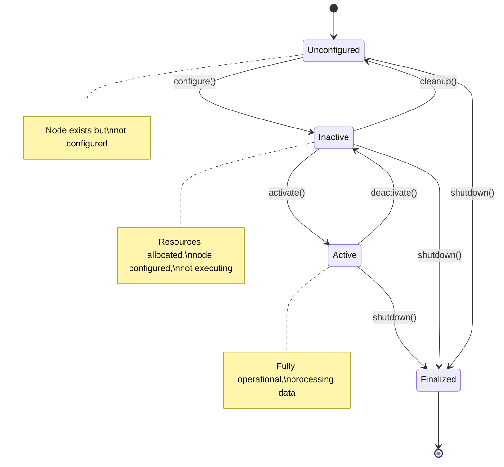
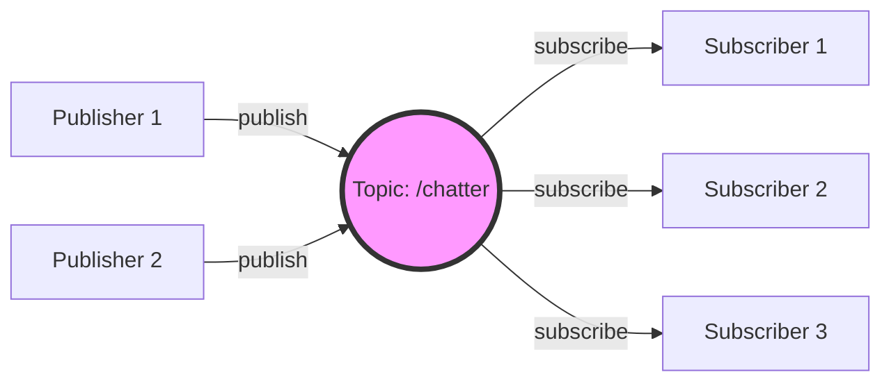
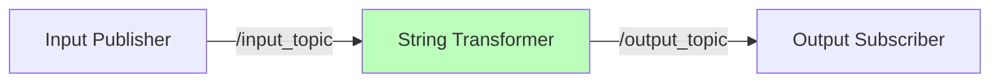
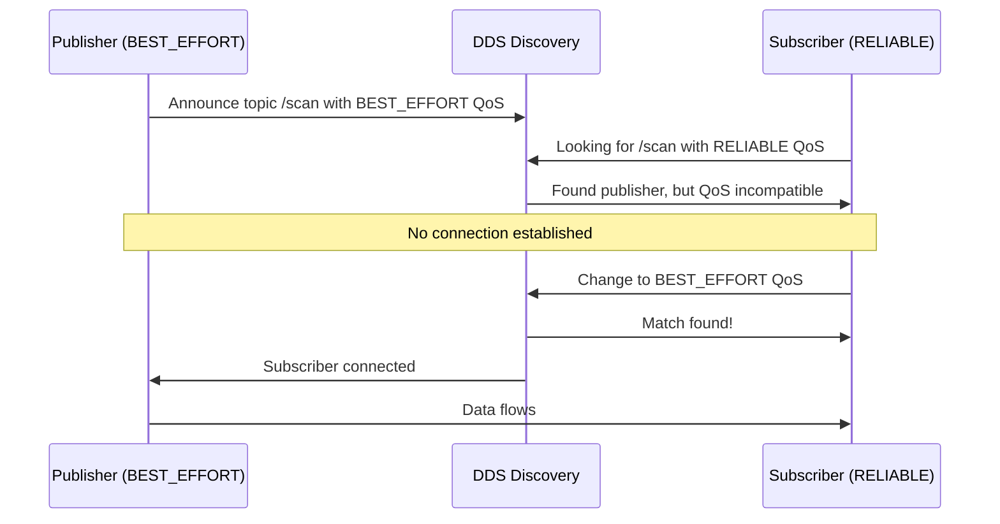
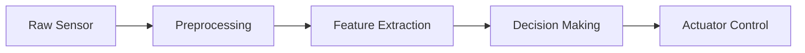
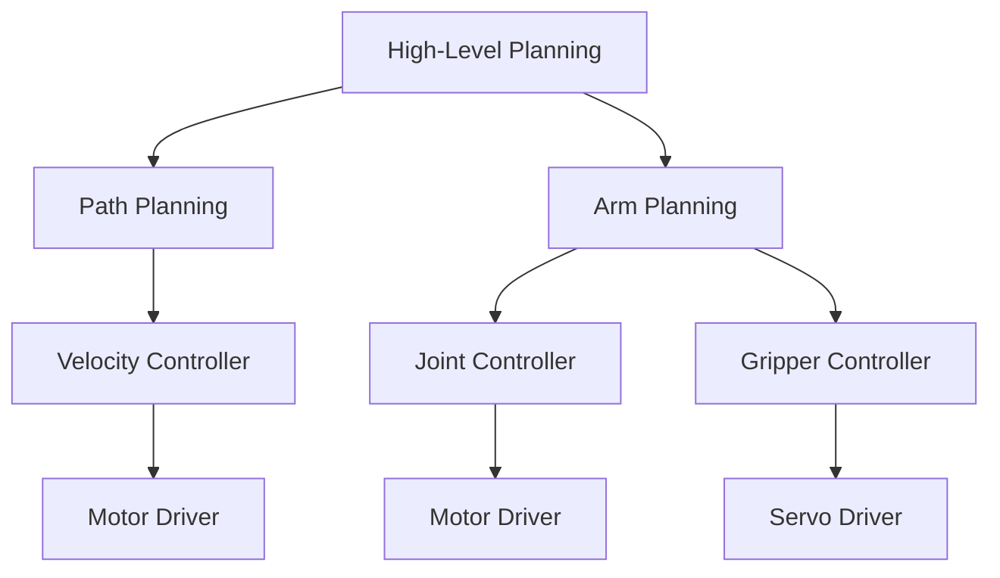

# Nodes and Topics

## Prerequisites

Before diving into this chapter, make sure you have:

- **Completed Chapter 1**: Understanding of what ROS 2 is and its basic architecture
- **ROS 2 Humble Hawksbill installed**: A working ROS 2 environment on Ubuntu 22.04 or equivalent
- **Basic programming knowledge**: Familiarity with Python or C++ fundamentals (variables, functions, classes)
- **Terminal proficiency**: Comfortable running commands in a terminal

## Learning Objectives

By the end of this chapter, you will be able to:

1. **Understand ROS 2 node architecture**: Explain what nodes are, their role in ROS 2 systems, and their lifecycle
2. **Create publisher and subscriber nodes**: Write working publisher and subscriber nodes in both Python and C++
3. **Implement topic-based communication**: Understand the publish-subscribe pattern and how topics enable asynchronous communication
4. **Work with message types**: Use standard ROS 2 messages and create custom message types for specific needs
5. **Debug multi-node systems**: Use ROS 2 command-line tools (`ros2 node`, `ros2 topic`) to inspect and troubleshoot communication
6. **Design scalable architectures**: Apply design patterns to organize multi-node systems effectively

---

## 1. Node Architecture

### 1.1 What is a Node?

In ROS 2, a **node** is an independent process that performs a specific computational task. Think of nodes as the fundamental building blocks of your robot application—each node has a single, well-defined responsibility.

**Why nodes?** Breaking your robot's functionality into separate nodes provides several advantages:
- **Modularity**: Each node focuses on one task (e.g., reading camera data, processing images, controlling motors)
- **Reusability**: Nodes can be reused across different robot projects
- **Fault isolation**: If one node crashes, others can continue running
- **Distributed computing**: Nodes can run on different machines

**Real-world examples:**
- **Camera node**: Captures images from a camera and publishes them
- **Image processor node**: Subscribes to camera images, detects objects, publishes results
- **Motor controller node**: Subscribes to velocity commands, controls robot wheels


Each node operates independently but collaborates through message passing to achieve complex robotic behaviors.

### 1.2 Node Lifecycle States

ROS 2 supports two types of nodes: **managed nodes** (with explicit lifecycle) and **non-managed nodes** (simpler, default behavior).

**For beginners**, most nodes you'll create are **non-managed nodes**—they start immediately and run until stopped. However, understanding the lifecycle concept is important for advanced applications.

**Managed nodes** transition through four lifecycle states:



**Lifecycle states explained:**

1. **Unconfigured**: Node created but not yet configured (initial state)
2. **Inactive**: Node configured with allocated resources but not actively processing data
3. **Active**: Node fully operational—publishing, subscribing, executing callbacks
4. **Finalized**: Node shutting down, releasing all resources (terminal state)

**State transitions:**
- `configure()`: Load configuration, allocate resources
- `activate()`: Start execution (timers, callbacks begin running)
- `deactivate()`: Pause execution while retaining resources
- `cleanup()`: Release resources, return to unconfigured
- `shutdown()`: Terminate node

**Key insight for this chapter**: We'll focus on simpler non-managed nodes that go directly to "Active" when started. Managed lifecycle is an advanced topic covered in later chapters, but understanding these states helps you grasp how ROS 2 nodes can be controlled deterministically in production systems.

### 1.3 Node Initialization & Execution

Every ROS 2 node follows a standard initialization and execution pattern. Here's what happens under the hood:

**Initialization steps:**

1. **Initialize ROS 2 client library**: `rclpy.init()` (Python) or `rclcpp::init()` (C++)
   - Sets up ROS 2 communication infrastructure
   - Must be called before creating any nodes

2. **Create node instance**: Instantiate your custom Node class
   - Node gets a unique name (e.g., `'minimal_publisher'`)
   - Node registers with the ROS 2 network

3. **Spin the node**: Keep node running and processing callbacks
   - `rclpy.spin(node)` (Python) or `rclcpp::spin(node)` (C++)
   - Enters event loop—waits for messages, timers, service calls

4. **Shutdown**: Clean up resources when done
   - `node.destroy_node()` and `rclpy.shutdown()`

**Basic Python node skeleton:**

```python
import rclpy
from rclpy.node import Node

class MinimalNode(Node):
    def __init__(self):
        super().__init__('minimal_node')  # Node name
        self.get_logger().info('Node started!')

def main():
    rclpy.init()                    # 1. Initialize ROS 2
    node = MinimalNode()            # 2. Create node
    rclpy.spin(node)                # 3. Spin (run until Ctrl+C)
    node.destroy_node()             # 4. Cleanup
    rclpy.shutdown()

if __name__ == '__main__':
    main()
```

**What happens during spin:**
- ROS 2 monitors for incoming messages on subscribed topics
- Timers trigger their callbacks at specified intervals
- Service requests are processed
- The node stays alive until interrupted (Ctrl+C) or `shutdown()` is called

**Execution flow**: Initialize → Create → Spin → Shutdown

This pattern is consistent across all ROS 2 nodes, whether simple or complex.

### 1.4 Node Naming & Namespaces

Every node in a ROS 2 system must have a unique name within its namespace. Proper naming enables you to identify, inspect, and manage nodes effectively.

**Node names:**
- Must be unique within the same namespace
- Use descriptive names: `camera_driver`, `object_detector`, `motor_controller`
- Follow snake_case convention: lowercase with underscores

**Namespaces** organize nodes hierarchically, similar to file system directories:

```
/robot1/camera          # Camera node for robot1
/robot1/controller      # Controller node for robot1
/robot2/camera          # Camera node for robot2 (different namespace)
```

**Why namespaces?**
- **Multi-robot systems**: Run identical nodes for different robots without name conflicts
- **Organization**: Group related nodes logically
- **Isolation**: Separate development/testing environments

**Remapping** allows changing node and topic names at runtime without modifying code:

```bash
# Run node with custom name
ros2 run my_package my_node --ros-args -r __node:=custom_name

# Run node in namespace
ros2 run my_package my_node --ros-args -r __ns:=/robot1
```

**Inspecting nodes:**

```bash
# List all active nodes
ros2 node list

# Get detailed info about a specific node
ros2 node info /minimal_publisher
```

**Example output:**
```
/minimal_publisher
  Subscribers:
  Publishers:
    /chatter: std_msgs/msg/String
  Service Servers:
  Service Clients:
  Action Servers:
  Action Clients:
```

Proper naming and namespace usage becomes critical in multi-node, multi-robot systems—start building good habits now!

---

## 2. Topics & Communication

### 2.1 The Publish-Subscribe Pattern

ROS 2 uses the **publish-subscribe pattern** for asynchronous communication between nodes. This is fundamentally different from direct function calls or request-reply patterns.

**Core concept**: Publishers send messages to named **topics** without knowing who (if anyone) is listening. Subscribers listen to topics without knowing who is publishing. This **decoupling** is powerful:

**Radio broadcast analogy:**
- **Publisher** = Radio station broadcasting on a frequency (topic)
- **Topic** = Frequency/channel (e.g., FM 101.5)
- **Subscriber** = Radio receiver tuned to that frequency
- The station doesn't know how many radios are listening
- Radios don't know which station is broadcasting—they just receive



**Advantages of pub-sub:**

1. **Loose coupling**: Publishers and subscribers don't need to know about each other
   - Add/remove subscribers without changing publisher code
   - Add/remove publishers without changing subscriber code

2. **Scalability**: One publisher can serve many subscribers
   - Camera publishes images once; multiple nodes can process them differently

3. **Flexibility**: Dynamic system composition
   - Nodes can come online/offline without system-wide reconfiguration

4. **Reusability**: Generic nodes work in different contexts
   - Same camera node works whether processing images or just logging them

**Contrast with request-reply (services):**
- **Pub-sub**: Continuous data streams, one-way, asynchronous (sensor data, commands)
- **Services**: One-time requests, two-way, synchronous (compute inverse kinematics, save file)

We'll cover services in Chapter 3. For now, focus on pub-sub for streaming data.

### 2.2 Topic Naming Conventions

Topics are identified by names—strings that act as channels. Good naming is essential for maintainable systems.

**Topic naming rules:**
- Use **descriptive, hierarchical names**: `/robot/sensor/camera/image_raw`
- Follow **snake_case**: lowercase with underscores
- Start with `/`: leading slash for absolute names (relative names also supported)
- Organize logically: group related topics with common prefixes

**Common topic names in robotics:**

| Topic Name | Purpose | Message Type |
|------------|---------|--------------|
| `/camera/image_raw` | Raw camera images | `sensor_msgs/Image` |
| `/cmd_vel` | Velocity commands for mobile base | `geometry_msgs/Twist` |
| `/odom` | Odometry (position/velocity estimate) | `nav_msgs/Odometry` |
| `/scan` | Laser scanner data | `sensor_msgs/LaserScan` |
| `/joint_states` | Robot joint positions/velocities | `sensor_msgs/JointState` |

**Namespace in topics:**

When nodes run in namespaces, topics inherit the namespace:

```bash
# Node in /robot1 namespace publishes to /camera/image
# Actual topic becomes: /robot1/camera/image

ros2 run my_package camera_node --ros-args -r __ns:=/robot1
```

This enables multi-robot systems where each robot has identical topic structures but different namespaces.

**Best practices:**
- **Be descriptive**: `/camera/image_raw` better than `/img`
- **Avoid abbreviations**: `/laser/scan` better than `/lsr/scn`
- **Use hierarchy**: `/robot/left_arm/joint_states` shows structure
- **Follow conventions**: Check `ros2 topic list` on existing robots to see common patterns

### 2.3 Many-to-Many Communication

The pub-sub pattern naturally supports **many-to-many communication**—multiple publishers and multiple subscribers on the same topic.

**Common patterns:**

**1. One publisher → Many subscribers** (Data distribution)
```
Camera Node → /image_raw → [Object Detector, Logger, Display Node]
```
- Camera publishes images once
- Multiple nodes process them differently
- Efficient: data sent once, used many ways

**2. Many publishers → One subscriber** (Data aggregation)
```
[Sensor 1, Sensor 2, Sensor 3] → /sensor_data → Fusion Node
```
- Multiple sensors publish to same topic
- Fusion node combines all sensor data
- Example: Multiple LIDARs covering different angles

**3. Many-to-many** (Full flexibility)
```
[Publisher A, Publisher B] → /topic → [Subscriber X, Subscriber Y]
```
- Any combination supported
- ROS 2 handles routing automatically

**Use case: Redundant sensors**

For safety-critical applications, deploy redundant sensors:

```
Front LIDAR  → /scan ← Processing Node 1
Rear LIDAR   ↗        ← Processing Node 2
```

Multiple LIDARs publish to `/scan`. Multiple processing nodes consume the data. If one LIDAR fails, others continue. If one processor crashes, backups take over.

**Key insight**: You don't configure connections manually. Just publish to a topic, subscribe to a topic—ROS 2 handles discovery and routing automatically.

### 2.4 Topic Discovery

How do nodes find each other? ROS 2 uses **DDS (Data Distribution Service)** for automatic discovery.

**Discovery mechanism (simplified):**

1. **Publisher announces**: "I publish `std_msgs/String` messages on topic `/chatter`"
2. **DDS broadcasts** this information to the local network
3. **Subscribers listen**: "I'm looking for `std_msgs/String` on `/chatter`"
4. **DDS matches** publishers and subscribers based on topic name and message type
5. **Connection established** automatically—data flows

**No central broker required:**
- Unlike ROS 1 (which needed `roscore`), ROS 2 has no single point of failure
- Nodes discover each other via multicast/broadcast
- Fully distributed system

**Implications:**

- **Dynamic composition**: Start/stop nodes at any time
  - Subscriber started after publisher? No problem—connects automatically when discovered
  - Publisher started after subscriber? Subscriber receives messages as soon as publisher comes online

- **Network transparency**: Nodes on different machines discover each other
  - Camera on Robot → Processing on laptop → Visualization on desktop
  - Same code, different machines

- **Resilience**: No central registry to fail
  - If any node crashes, others continue operating

**Inspecting the network:**

```bash
# List all active topics
ros2 topic list

# See who's publishing/subscribing to a topic
ros2 topic info /chatter

# See detailed information with types
ros2 topic info /chatter --verbose
```

**Example output:**
```
Topic: /chatter
Publisher count: 1
Subscription count: 2
```

Discovery "just works"—you don't configure it manually. Just publish and subscribe; ROS 2 connects the dots!

---

## 3. Creating Publishers

Now that you understand nodes and topics conceptually, let's write code. We'll start with **publishers**—nodes that send messages to topics.

### 3.1 Python Publisher Example

A publisher node creates messages and sends them to a topic at regular intervals. Here's a complete working example:

```python
#!/usr/bin/env python3
"""
Minimal publisher that sends string messages to /chatter topic.
"""

import rclpy
from rclpy.node import Node
from std_msgs.msg import String


class MinimalPublisher(Node):
    """
    Publisher node that sends "Hello ROS 2" messages every 0.5 seconds.
    """

    def __init__(self):
        super().__init__('minimal_publisher')  # Node name

        # Create publisher: (message_type, topic_name, queue_size)
        self.publisher_ = self.create_publisher(String, '/chatter', 10)

        # Create timer: publish every 0.5 seconds (2 Hz)
        self.timer = self.create_timer(0.5, self.timer_callback)

        self.counter = 0  # Message counter
        self.get_logger().info('Publisher node started')

    def timer_callback(self):
        """
        Timer callback: called every 0.5 seconds to publish a message.
        """
        msg = String()  # Create message instance
        msg.data = f'Hello ROS 2: {self.counter}'  # Set message data

        self.publisher_.publish(msg)  # Publish message to topic
        self.get_logger().info(f'Publishing: "{msg.data}"')  # Log output

        self.counter += 1  # Increment counter


def main(args=None):
    rclpy.init(args=args)  # Initialize ROS 2 Python client library

    node = MinimalPublisher()  # Create node instance

    try:
        rclpy.spin(node)  # Keep node running until interrupted
    except KeyboardInterrupt:
        pass

    node.destroy_node()  # Clean up node
    rclpy.shutdown()  # Shutdown ROS 2 Python client library


if __name__ == '__main__':
    main()
```

**Code breakdown:**

1. **Imports**: We need `rclpy` (ROS 2 Python client library), `Node` base class, and `String` message type from `std_msgs`.

2. **Class definition**: `MinimalPublisher` inherits from `Node`. The constructor calls `super().__init__('minimal_publisher')` to initialize the node with a unique name.

3. **Publisher creation**: `self.create_publisher(String, '/chatter', 10)` creates a publisher that sends `String` messages to the `/chatter` topic. The `10` is the **queue size**—how many messages to buffer if subscribers can't keep up.

4. **Timer setup**: `self.create_timer(0.5, self.timer_callback)` creates a timer that calls `timer_callback()` every 0.5 seconds (2 Hz frequency). This is how we publish periodically.

5. **Callback function**: `timer_callback()` runs every 0.5 seconds. It creates a `String` message, sets the `data` field, publishes it using `self.publisher_.publish(msg)`, and logs the output.

6. **Main function**: Standard ROS 2 node execution pattern:
   - `rclpy.init()`: Initialize ROS 2
   - Create node instance
   - `rclpy.spin(node)`: Keep node alive and processing callbacks
   - Clean up on exit (Ctrl+C)

**Running the publisher:**

Save this file as `minimal_publisher.py`, make it executable (`chmod +x minimal_publisher.py`), and run:

```bash
python3 minimal_publisher.py
```

**Expected output:**
```
[INFO] [minimal_publisher]: Publisher node started
[INFO] [minimal_publisher]: Publishing: "Hello ROS 2: 0"
[INFO] [minimal_publisher]: Publishing: "Hello ROS 2: 1"
[INFO] [minimal_publisher]: Publishing: "Hello ROS 2: 2"
...
```

The node publishes messages every 0.5 seconds, incrementing the counter each time. Press **Ctrl+C** to stop.

**Key insight**: Publishers don't wait for subscribers. Even if no one is listening, the publisher keeps sending messages. This is the power of decoupled communication—publishers and subscribers operate independently.

### 3.2 C++ Publisher Example

For those interested in C++, here's the equivalent publisher. The logic is identical—create a publisher, set up a timer, and publish messages periodically.

```cpp
// minimal_publisher.cpp
/**
 * Minimal publisher that sends string messages to /chatter topic.
 */

#include <chrono>
#include <functional>
#include <memory>
#include <string>

#include "rclcpp/rclcpp.hpp"
#include "std_msgs/msg/string.hpp"

using namespace std::chrono_literals;  // Enables "500ms" syntax

class MinimalPublisher : public rclcpp::Node
{
public:
  MinimalPublisher()
  : Node("minimal_publisher"), counter_(0)  // Initialize node name and counter
  {
    // Create publisher: (topic_name, queue_size)
    publisher_ = this->create_publisher<std_msgs::msg::String>("/chatter", 10);

    // Create timer: call timer_callback every 500ms
    timer_ = this->create_wall_timer(
      500ms, std::bind(&MinimalPublisher::timer_callback, this));

    RCLCPP_INFO(this->get_logger(), "Publisher node started");
  }

private:
  void timer_callback()
  {
    // Create and populate message
    auto message = std_msgs::msg::String();
    message.data = "Hello ROS 2: " + std::to_string(counter_);

    // Publish message
    publisher_->publish(message);
    RCLCPP_INFO(this->get_logger(), "Publishing: '%s'", message.data.c_str());

    counter_++;
  }

  // Member variables
  rclcpp::Publisher<std_msgs::msg::String>::SharedPtr publisher_;
  rclcpp::TimerBase::SharedPtr timer_;
  size_t counter_;
};

int main(int argc, char * argv[])
{
  rclcpp::init(argc, argv);  // Initialize ROS 2 C++ client library

  auto node = std::make_shared<MinimalPublisher>();  // Create node (shared pointer)

  rclcpp::spin(node);  // Keep node running until interrupted

  rclcpp::shutdown();  // Clean up ROS 2 C++ client library
  return 0;
}
```

**Key differences from Python:**

1. **Memory management**: C++ uses **shared pointers** (`std::shared_ptr`) for nodes and publishers. This ensures proper memory cleanup when nodes are destroyed.

2. **Timer creation**: `create_wall_timer()` uses `std::chrono` duration literals (`500ms`). The callback is bound using `std::bind`.

3. **Message creation**: Messages are created as local variables (`auto message = std_msgs::msg::String()`), not explicit constructors.

4. **Logging**: `RCLCPP_INFO()` macro instead of `get_logger().info()`.

5. **Member initialization**: The constructor uses an initialization list (`: Node("minimal_publisher"), counter_(0)`) for efficiency.

**Expected output** (identical to Python):
```
[INFO] [minimal_publisher]: Publisher node started
[INFO] [minimal_publisher]: Publishing: 'Hello ROS 2: 0'
[INFO] [minimal_publisher]: Publishing: 'Hello ROS 2: 1'
...
```

**Which should you use?** For beginners, Python is more forgiving and faster to iterate. Use C++ when you need maximum performance (high-frequency control loops, real-time constraints) or are integrating with existing C++ libraries.

### 3.3 Package Setup

To run your publisher node properly, you need to package it in a ROS 2 workspace. Here's how:

**Python package structure:**

```
my_robot_package/
├── package.xml           # Package metadata and dependencies
├── setup.py              # Python package installation script
├── setup.cfg             # Python package configuration
├── resource/             # Package marker (for ROS 2 discovery)
│   └── my_robot_package
└── my_robot_package/     # Python module directory
    ├── __init__.py
    └── minimal_publisher.py
```

**package.xml** (dependencies declaration):

```xml
<?xml version="1.0"?>
<package format="3">
  <name>my_robot_package</name>
  <version>0.1.0</version>
  <description>ROS 2 node examples</description>
  <maintainer email="you@example.com">Your Name</maintainer>
  <license>MIT</license>

  <!-- Build tool -->
  <buildtool_depend>ament_python</buildtool_depend>

  <!-- Runtime dependencies -->
  <exec_depend>rclpy</exec_depend>
  <exec_depend>std_msgs</exec_depend>

  <export>
    <build_type>ament_python</build_type>
  </export>
</package>
```

**setup.py** (entry point configuration):

```python
from setuptools import setup

package_name = 'my_robot_package'

setup(
    name=package_name,
    version='0.1.0',
    packages=[package_name],
    install_requires=['setuptools'],
    zip_safe=True,
    maintainer='Your Name',
    maintainer_email='you@example.com',
    description='ROS 2 node examples',
    license='MIT',
    entry_points={
        'console_scripts': [
            'minimal_publisher = my_robot_package.minimal_publisher:main',
        ],
    },
)
```

**Building and running:**

```bash
# Navigate to workspace root
cd ~/ros2_ws

# Build the package
colcon build --packages-select my_robot_package

# Source the workspace
source install/setup.bash

# Run the node
ros2 run my_robot_package minimal_publisher
```

**C++ package structure:**

```
my_robot_package_cpp/
├── package.xml           # Package metadata
├── CMakeLists.txt        # CMake build configuration
└── src/
    └── minimal_publisher.cpp
```

**CMakeLists.txt** (build configuration):

```cmake
cmake_minimum_required(VERSION 3.8)
project(my_robot_package_cpp)

# Find dependencies
find_package(ament_cmake REQUIRED)
find_package(rclcpp REQUIRED)
find_package(std_msgs REQUIRED)

# Add executable
add_executable(minimal_publisher src/minimal_publisher.cpp)

# Link dependencies
ament_target_dependencies(minimal_publisher rclcpp std_msgs)

# Install executable
install(TARGETS
  minimal_publisher
  DESTINATION lib/${PROJECT_NAME})

ament_package()
```

**Key dependencies:**
- **rclpy** (Python) or **rclcpp** (C++): ROS 2 client library
- **std_msgs**: Standard message types (String, Int32, Float64, etc.)

Build and run using the same `colcon build` and `ros2 run` commands as Python.

---

## 4. Creating Subscribers

Now let's create the complementary piece—**subscribers** that receive messages from topics.

### 4.1 Python Subscriber Example

A subscriber listens to a topic and executes a callback function whenever a message arrives:

```python
#!/usr/bin/env python3
"""
Minimal subscriber that receives string messages from /chatter topic.
"""

import rclpy
from rclpy.node import Node
from std_msgs.msg import String


class MinimalSubscriber(Node):
    """
    Subscriber node that listens to /chatter and prints received messages.
    """

    def __init__(self):
        super().__init__('minimal_subscriber')  # Node name

        # Create subscription: (message_type, topic_name, callback, queue_size)
        self.subscription = self.create_subscription(
            String,
            '/chatter',
            self.listener_callback,
            10)

        self.get_logger().info('Subscriber node started, waiting for messages...')

    def listener_callback(self, msg):
        """
        Callback function: executed whenever a message is received.

        Args:
            msg (String): The received message
        """
        self.get_logger().info(f'I heard: "{msg.data}"')


def main(args=None):
    rclpy.init(args=args)  # Initialize ROS 2

    node = MinimalSubscriber()  # Create subscriber node

    try:
        rclpy.spin(node)  # Keep node alive and processing callbacks
    except KeyboardInterrupt:
        pass

    node.destroy_node()
    rclpy.shutdown()


if __name__ == '__main__':
    main()
```

**Code breakdown:**

1. **Subscription creation**: `self.create_subscription(String, '/chatter', self.listener_callback, 10)` creates a subscription to the `/chatter` topic. When a `String` message arrives, `listener_callback()` is called automatically.

2. **Callback function**: `listener_callback(self, msg)` receives the message as a parameter. Extract data using `msg.data` and process it (here, we just log it).

3. **Asynchronous execution**: Callbacks run automatically when messages arrive. You don't poll or check manually—ROS 2 handles this via the event loop in `rclpy.spin()`.

**Running the subscriber:**

Open a **new terminal** (keep the publisher running in the first terminal):

```bash
python3 minimal_subscriber.py
```

**Expected output:**
```
[INFO] [minimal_subscriber]: Subscriber node started, waiting for messages...
[INFO] [minimal_subscriber]: I heard: "Hello ROS 2: 5"
[INFO] [minimal_subscriber]: I heard: "Hello ROS 2: 6"
[INFO] [minimal_subscriber]: I heard: "Hello ROS 2: 7"
...
```

The subscriber receives and prints every message published by the publisher. The counter numbers might not start at 0 if the publisher was already running before the subscriber started—this is expected behavior.

**Testing it out:**

1. **Terminal 1**: Run `minimal_publisher.py` → starts publishing messages
2. **Terminal 2**: Run `minimal_subscriber.py` → starts receiving and printing messages
3. **Stop the publisher** (Ctrl+C in Terminal 1) → subscriber keeps running but receives no messages
4. **Restart the publisher** → subscriber immediately starts receiving messages again

This demonstrates the **decoupled nature** of pub-sub: nodes connect and disconnect dynamically without manual reconfiguration.

### 4.2 C++ Subscriber Example

Here's the C++ equivalent:

```cpp
// minimal_subscriber.cpp
/**
 * Minimal subscriber that receives string messages from /chatter topic.
 */

#include <memory>
#include "rclcpp/rclcpp.hpp"
#include "std_msgs/msg/string.hpp"

class MinimalSubscriber : public rclcpp::Node
{
public:
  MinimalSubscriber()
  : Node("minimal_subscriber")
  {
    // Create subscription: (topic_name, queue_size, callback)
    subscription_ = this->create_subscription<std_msgs::msg::String>(
      "/chatter", 10, std::bind(&MinimalSubscriber::listener_callback, this, std::placeholders::_1));

    RCLCPP_INFO(this->get_logger(), "Subscriber node started, waiting for messages...");
  }

private:
  void listener_callback(const std_msgs::msg::String::SharedPtr msg)
  {
    RCLCPP_INFO(this->get_logger(), "I heard: '%s'", msg->data.c_str());
  }

  rclcpp::Subscription<std_msgs::msg::String>::SharedPtr subscription_;
};

int main(int argc, char * argv[])
{
  rclcpp::init(argc, argv);

  auto node = std::make_shared<MinimalSubscriber>();

  rclcpp::spin(node);

  rclcpp::shutdown();
  return 0;
}
```

**Key differences:**

1. **Callback binding**: Uses `std::bind` with `std::placeholders::_1` to bind the callback method. The placeholder represents the incoming message parameter.

2. **Message parameter type**: `const std_msgs::msg::String::SharedPtr msg`—a shared pointer to a const message. Access data with `msg->data` (pointer syntax, not dot).

3. **Callback signature**: C++ callbacks receive `SharedPtr` (shared pointers) to messages, not copies, for efficiency.

**Expected output** (identical to Python):
```
[INFO] [minimal_subscriber]: Subscriber node started, waiting for messages...
[INFO] [minimal_subscriber]: I heard: 'Hello ROS 2: 10'
...
```

### 4.3 Callback Functions

Callbacks are the heart of subscribers—they define **what happens when a message arrives**.

**Callback characteristics:**

1. **Asynchronous execution**: Callbacks run whenever messages arrive, not on a fixed schedule. If messages arrive at 10 Hz, the callback executes 10 times per second.

2. **Message parameter**: Callbacks receive the message as a parameter. Extract fields using dot notation (Python: `msg.data`) or pointer syntax (C++: `msg->data`).

3. **Execution context**: Callbacks run in the ROS 2 event loop during `spin()`. They must complete quickly to avoid blocking other callbacks.

**Best practices:**

- **Keep callbacks short**: Long-running computations block other callbacks. If processing takes time, store the message and process it in a separate thread.

- **Avoid blocking operations**: Don't use `time.sleep()`, wait for user input, or perform long I/O operations in callbacks.

- **Thread safety**: By default, callbacks for a single node execute sequentially (no concurrent access). Advanced users can configure multi-threaded executors, but that's beyond beginner scope.

**Callback patterns:**

```python
# Pattern 1: Process message immediately
def listener_callback(self, msg):
    result = self.process_data(msg.data)  # Fast processing
    self.get_logger().info(f'Result: {result}')

# Pattern 2: Store message for later processing (if processing is slow)
def listener_callback(self, msg):
    self.latest_msg = msg  # Store message
    # Separate thread/timer processes self.latest_msg asynchronously
```

**Common mistake**: Calling `spin()` inside a callback causes deadlock. Never do this:

```python
# DON'T DO THIS!
def listener_callback(self, msg):
    rclpy.spin(self)  # DEADLOCK! spin() is already running
```

Callbacks should be **fast, focused, and non-blocking**.

---

## 5. Integration: Combined Publisher-Subscriber Node

Real-world nodes often both publish **and** subscribe—they receive data, process it, and publish results. Let's create a **data transformation pipeline** node.

### 5.1 Combined Node Example

This node subscribes to `/input_topic`, transforms received strings to uppercase, and publishes results to `/output_topic`:

```python
#!/usr/bin/env python3
"""
Combined publisher-subscriber node: receives strings, converts to uppercase, publishes result.
"""

import rclpy
from rclpy.node import Node
from std_msgs.msg import String


class StringTransformer(Node):
    """
    Transformation node: subscribes to /input_topic, publishes to /output_topic.
    """

    def __init__(self):
        super().__init__('string_transformer')

        # Create subscriber (input)
        self.subscription = self.create_subscription(
            String,
            '/input_topic',
            self.transform_callback,
            10)

        # Create publisher (output)
        self.publisher = self.create_publisher(String, '/output_topic', 10)

        self.get_logger().info('Transformer node started')

    def transform_callback(self, msg):
        """
        Receives input message, transforms it, publishes result.
        """
        # Transform data: convert to uppercase
        transformed_data = msg.data.upper()

        # Create output message
        output_msg = String()
        output_msg.data = transformed_data

        # Publish transformed message
        self.publisher.publish(output_msg)

        self.get_logger().info(f'Transformed: "{msg.data}" -> "{output_msg.data}"')


def main(args=None):
    rclpy.init(args=args)

    node = StringTransformer()

    try:
        rclpy.spin(node)
    except KeyboardInterrupt:
        pass

    node.destroy_node()
    rclpy.shutdown()


if __name__ == '__main__':
    main()
```

**How it works:**

1. **Subscribes** to `/input_topic`: When a message arrives, `transform_callback()` is called
2. **Transforms** data: Converts string to uppercase (example transformation)
3. **Publishes** result to `/output_topic`: Other nodes can subscribe to this for further processing

**Running a 3-node pipeline:**

**Terminal 1** (input publisher):
```bash
# Publish to /input_topic using command-line
ros2 topic pub /input_topic std_msgs/msg/String "data: 'hello ros2'" --rate 1
```

**Terminal 2** (transformer):
```bash
python3 string_transformer.py
```

**Terminal 3** (output subscriber):
```bash
# Listen to /output_topic
ros2 topic echo /output_topic
```

**Data flow:**
```
ros2 topic pub → /input_topic → string_transformer → /output_topic → ros2 topic echo
   "hello ros2"                      (transforms)        "HELLO ROS2"
```

**Expected output in Terminal 2** (transformer):
```
[INFO] [string_transformer]: Transformer node started
[INFO] [string_transformer]: Transformed: "hello ros2" -> "HELLO ROS2"
```

**Expected output in Terminal 3** (echo):
```
data: HELLO ROS2
---
```

**Pipeline visualization:**



**Use cases:**
- **Image processing**: Camera → Edge detector → Object recognizer → Controller
- **Sensor fusion**: [IMU, GPS, Odometry] → Fusion node → Localization output
- **Control loops**: Sensor → Controller → Motor commands

Combined nodes are the building blocks of complex robotic systems. Each node does one thing well, and chaining them creates sophisticated behaviors.

---

## 6. Message Types

Messages are the **data structures** that flow through topics. Understanding message types is crucial for effective communication between nodes.

### 6.1 ROS 2 Message Structure

ROS 2 uses **strongly typed** messages—publishers and subscribers must agree on the exact message type for communication to work.

**Message structure:**
- Messages are defined in `.msg` files
- Contain **fields** with specific types (primitives, arrays, nested messages)
- Compiled into Python/C++ classes during build

**Example: `geometry_msgs/Twist` (velocity commands)**

```
# Twist.msg - Linear and angular velocity
geometry_msgs/Vector3 linear   # Linear velocity (x, y, z)
geometry_msgs/Vector3 angular  # Angular velocity (roll, pitch, yaw)
```

This message contains **two nested messages** (`Vector3`), each with three float fields:

```
# Vector3.msg
float64 x
float64 y
float64 z
```

**Inspecting message types:**

```bash
# Show structure of a message type
ros2 interface show geometry_msgs/msg/Twist

# Output:
# geometry_msgs/Vector3 linear
#   float64 x
#   float64 y
#   float64 z
# geometry_msgs/Vector3 angular
#   float64 x
#   float64 y
#   float64 z
```

**Using messages in code:**

```python
from geometry_msgs.msg import Twist

# Create message instance
cmd = Twist()
cmd.linear.x = 0.5   # Move forward at 0.5 m/s
cmd.linear.y = 0.0
cmd.linear.z = 0.0
cmd.angular.z = 0.2  # Turn left at 0.2 rad/s

publisher.publish(cmd)
```

**Field types:**
- **Primitives**: `bool`, `int8`-`int64`, `uint8`-`uint64`, `float32`/`float64`, `string`
- **Arrays**: Fixed (`float64[3]`) or dynamic (`int32[]`)
- **Nested messages**: Messages can contain other messages

Strong typing ensures **compile-time safety**—you can't accidentally publish an `Int32` to a topic expecting a `String`.

### 6.2 Standard Message Packages

ROS 2 provides **standard message packages** for common robotics data types. Use these whenever possible—don't reinvent the wheel!

**Common message packages:**

| Package | Purpose | Example Messages |
|---------|---------|------------------|
| **std_msgs** | Basic types | `String`, `Int32`, `Float64`, `Bool`, `Empty` |
| **geometry_msgs** | Geometric primitives | `Point`, `Pose`, `Twist`, `Transform` |
| **sensor_msgs** | Sensor data | `Image`, `LaserScan`, `Imu`, `JointState`, `PointCloud2` |
| **nav_msgs** | Navigation | `Odometry`, `Path`, `OccupancyGrid` |
| **std_srvs** | Basic services | `SetBool`, `Trigger`, `Empty` |

**Examples with use cases:**

1. **std_msgs/String**: Simple text messages (logging, status updates)
2. **geometry_msgs/Twist**: Robot velocity commands (mobile base control)
3. **sensor_msgs/Image**: Camera images (computer vision pipelines)
4. **sensor_msgs/LaserScan**: 2D laser scanner data (obstacle detection)
5. **nav_msgs/Odometry**: Robot position and velocity estimates (localization)

**When to use standard vs custom messages:**

**Use standard messages when:**
- Your data fits an existing message type
- You want interoperability with other ROS 2 packages
- Example: Publishing camera images? Use `sensor_msgs/Image`

**Create custom messages when:**
- No standard message fits your needs
- You need domain-specific data structures
- Example: Custom sensor with unique data format

**Browsing available messages:**

```bash
# List all message packages
ros2 interface packages

# List messages in a package
ros2 interface package geometry_msgs

# Show message definition
ros2 interface show sensor_msgs/msg/Image
```

Always check if a standard message exists before creating a custom one!

### 6.3 Creating Custom Messages

Sometimes you need custom message types for domain-specific data. Here's how to create them:

**Use case**: You're building a person-tracking robot and need a message to represent detected persons:

```
# PersonInfo.msg - Custom message for person detection
string name
uint8 age
float32 distance  # Distance from robot in meters
float32 confidence  # Detection confidence (0.0 - 1.0)
```

**Step-by-step process:**

**1. Create package structure**

```
my_robot_interfaces/
├── package.xml
├── CMakeLists.txt
└── msg/
    └── PersonInfo.msg
```

**2. Define message in `msg/PersonInfo.msg`**

```
string name
uint8 age
float32 distance
float32 confidence
```

**3. Update `package.xml`** (add dependencies)

```xml
<buildtool_depend>rosidl_default_generators</buildtool_depend>
<exec_depend>rosidl_default_runtime</exec_depend>
<member_of_group>rosidl_interface_packages</member_of_group>
```

**4. Update `CMakeLists.txt`** (configure message generation)

```cmake
find_package(rosidl_default_generators REQUIRED)

# Declare message files
rosidl_generate_interfaces(${PROJECT_NAME}
  "msg/PersonInfo.msg"
)
```

**5. Build the package**

```bash
colcon build --packages-select my_robot_interfaces
source install/setup.bash
```

**6. Use custom message in code**

```python
from my_robot_interfaces.msg import PersonInfo

# In publisher
person_msg = PersonInfo()
person_msg.name = "Alice"
person_msg.age = 30
person_msg.distance = 2.5
person_msg.confidence = 0.95
publisher.publish(person_msg)

# In subscriber callback
def person_callback(self, msg):
    self.get_logger().info(
        f'Detected: {msg.name}, age {msg.age}, '
        f'distance {msg.distance}m (confidence: {msg.confidence})'
    )
```

**Best practices:**
- **Package naming**: Use `_interfaces` or `_msgs` suffix (e.g., `my_robot_interfaces`)
- **Message naming**: Use descriptive names in PascalCase (e.g., `PersonInfo`, not `person_info`)
- **Separate interfaces package**: Keep messages in a dedicated package for reusability

Custom messages enable you to model your specific problem domain while maintaining ROS 2's type safety.

### 6.4 Headers & Timestamps

Many messages include a **Header** field for synchronization and coordinate frame tracking:

```
# std_msgs/Header
builtin_interfaces/Time stamp  # Timestamp when data was acquired
string frame_id                # Coordinate frame for geometric data
```

**Example: `sensor_msgs/Image`**

```
std_msgs/Header header  # Timestamp and frame info
uint32 height
uint32 width
string encoding
# ... image data ...
```

**Why headers matter:**

1. **Timestamp synchronization**: Match sensor data from different sources by timestamp
   - Example: Align camera images with LIDAR scans from the same moment

2. **Coordinate frames**: Specify which coordinate frame geometric data is expressed in
   - Example: Camera image is in `camera_frame`, robot position is in `base_link`

3. **ROS time vs system time**: ROS 2 supports simulated time for replay (covered in advanced topics)

**Using headers in code:**

```python
from sensor_msgs.msg import Image
from std_msgs.msg import Header

# Create image message with header
img_msg = Image()
img_msg.header.stamp = self.get_clock().now().to_msg()  # Current time
img_msg.header.frame_id = 'camera_frame'                # Coordinate frame
img_msg.height = 480
img_msg.width = 640
# ... set image data ...

publisher.publish(img_msg)
```

**Key insight**: If your message represents physical sensor data or geometry, include a `Header`. It's essential for multi-sensor systems and coordinate transformations (covered in later chapters).

---

## 7. Quality of Service (QoS) Policies

QoS policies give you **fine-grained control** over communication behavior. Different use cases require different reliability, durability, and performance trade-offs.

### 7.1 What are QoS Policies?

In ROS 1, all communication used the same settings. ROS 2 inherits DDS's **Quality of Service** framework, allowing you to configure communication on a per-topic basis.

**Why QoS?**
- **Sensor data**: High-frequency, lossy OK → use BEST_EFFORT
- **Commands**: Critical, must arrive → use RELIABLE
- **Late joiners**: Need last published value → use TRANSIENT_LOCAL durability

ROS 2 provides multiple QoS **policy dimensions**:

| Policy | Options | Purpose |
|--------|---------|---------|
| **Reliability** | RELIABLE, BEST_EFFORT | Guaranteed delivery vs low latency |
| **Durability** | VOLATILE, TRANSIENT_LOCAL | Keep messages for late subscribers? |
| **History** | KEEP_LAST(n), KEEP_ALL | How many messages to buffer |
| **Deadline** | Duration | Max time between messages |
| **Lifespan** | Duration | How long messages remain valid |
| **Liveliness** | Policy | Detect if publisher is alive |

We'll focus on the three most important: **Reliability**, **Durability**, and **History**.

### 7.2 Reliability Policies

Reliability determines whether messages are **guaranteed to arrive** or can be dropped.

**RELIABLE** (default for most topics):
- **Guaranteed delivery**: Messages are retransmitted if lost
- **Acknowledgments**: Subscriber confirms receipt
- **Trade-off**: Higher latency, more bandwidth
- **Use cases**: Commands, critical state updates, configuration

**BEST_EFFORT**:
- **Fire-and-forget**: No retransmission if message is lost
- **No acknowledgments**: Lower overhead
- **Trade-off**: Messages may be dropped
- **Use cases**: High-frequency sensor data (camera, LIDAR), odometry

**Example scenarios:**

```
Camera publishing at 30 Hz → BEST_EFFORT
  Rationale: If one frame is lost, the next frame arrives 33ms later.
  No need to retransmit old data.

Emergency stop command → RELIABLE
  Rationale: Missing this command could cause damage.
  Must guarantee delivery.
```

**Configuring reliability:**

```python
from rclpy.qos import QoSProfile, ReliabilityPolicy

# BEST_EFFORT example (sensor data)
qos_profile = QoSProfile(
    reliability=ReliabilityPolicy.BEST_EFFORT,
    depth=10
)

publisher = self.create_publisher(
    Image,
    '/camera/image_raw',
    qos_profile
)

# RELIABLE example (commands)
qos_profile = QoSProfile(
    reliability=ReliabilityPolicy.RELIABLE,
    depth=10
)

publisher = self.create_publisher(
    Twist,
    '/cmd_vel',
    qos_profile
)
```

**Key insight**: Choose reliability based on **data characteristics**, not topic name. Sensor streams → BEST_EFFORT. Commands/state → RELIABLE.

### 7.3 Durability & History

**Durability** determines whether messages are **kept for late-joining subscribers**.

**VOLATILE** (default):
- Messages not saved for late joiners
- Subscribers only receive messages published **after** they subscribe
- Use for: Real-time streaming data

**TRANSIENT_LOCAL**:
- Last N messages saved (based on History policy)
- Late subscribers receive stored messages immediately
- Use for: Configuration, status that should persist

**History** determines **how many messages to buffer**.

**KEEP_LAST(n)**:
- Keep last `n` messages in queue
- Oldest discarded when queue full
- Use for: Most topics (n=10 is common default)

**KEEP_ALL**:
- Keep all messages until delivered
- Can consume unbounded memory
- Use for: Critical messages that must never be lost

**Example: Late joiner scenario**

```python
# Publisher with TRANSIENT_LOCAL durability
from rclpy.qos import QoSProfile, DurabilityPolicy, HistoryPolicy

qos_profile = QoSProfile(
    durability=DurabilityPolicy.TRANSIENT_LOCAL,
    history=HistoryPolicy.KEEP_LAST,
    depth=1  # Keep last message only
)

# Publisher sends robot status every 5 seconds
status_pub = self.create_publisher(Status, '/robot_status', qos_profile)

# Scenario:
# 1. Publisher sends status at t=0s
# 2. Subscriber starts at t=3s
# 3. Subscriber IMMEDIATELY receives status from t=0s (not waiting until t=5s)
```

**Use case: Robot configuration**

```python
# Publish robot configuration once at startup
config_pub = self.create_publisher(
    Config,
    '/robot_config',
    QoSProfile(
        durability=DurabilityPolicy.TRANSIENT_LOCAL,
        history=HistoryPolicy.KEEP_LAST,
        depth=1
    )
)

# Any node that starts later gets the config immediately
```

**Depth selection:**
- **depth=1**: Only need most recent (status, config)
- **depth=10**: Standard buffering (most topics)
- **depth=100+**: High-frequency data with potential bursts

### 7.4 QoS Compatibility

For communication to work, publisher and subscriber QoS policies must be **compatible**.

**Compatibility rules (simplified):**

| Publisher | Subscriber | Compatible? |
|-----------|------------|-------------|
| RELIABLE | RELIABLE | Yes |
| RELIABLE | BEST_EFFORT | Yes (subscriber gets all messages) |
| BEST_EFFORT | RELIABLE | **No** (incompatible) |
| BEST_EFFORT | BEST_EFFORT | Yes |

**Why incompatibility?** A RELIABLE subscriber expects acknowledgments. A BEST_EFFORT publisher doesn't send them. They can't communicate.

**Debugging QoS issues:**

```bash
# Check QoS settings for a topic
ros2 topic info /camera/image_raw --verbose

# Output shows:
# Publisher QoS: BEST_EFFORT, VOLATILE
# Subscriber QoS: RELIABLE, VOLATILE
# Status: Incompatible (no connection established)
```

**Sequence diagram: QoS negotiation**



**Fixing incompatibility:**

1. **Match QoS profiles**: Make publisher and subscriber use the same QoS
2. **Use predefined profiles**: ROS 2 provides standard profiles (see next section)
3. **Publisher = more reliable**: Set publisher to RELIABLE if subscriber needs it

### 7.5 Predefined QoS Profiles

ROS 2 provides convenient **predefined profiles** for common scenarios:

```python
from rclpy.qos import qos_profile_sensor_data, qos_profile_system_default

# Sensor data profile: BEST_EFFORT, VOLATILE, KEEP_LAST(5)
camera_pub = self.create_publisher(
    Image,
    '/camera/image',
    qos_profile_sensor_data
)

# System default: RELIABLE, VOLATILE, KEEP_LAST(10)
cmd_pub = self.create_publisher(
    Twist,
    '/cmd_vel',
    qos_profile_system_default  # Or just use 10 as shorthand
)
```

**Available profiles:**
- `qos_profile_sensor_data`: BEST_EFFORT, VOLATILE, KEEP_LAST(5)
- `qos_profile_default` / `qos_profile_system_default`: RELIABLE, VOLATILE, KEEP_LAST(10)
- `qos_profile_services_default`: For ROS 2 services (covered in Chapter 3)
- `qos_profile_parameters`: For parameter communication

**When to use custom QoS vs profiles:**
- **Use profiles** for standard cases (90% of the time)
- **Customize** for specific needs (late joiners, high-frequency data, critical commands)

---

## 8. Debugging Tools

ROS 2 provides powerful command-line tools for inspecting and debugging multi-node systems. Mastering these tools is essential for troubleshooting.

### 8.1 ros2 node Commands

Inspect active nodes and their connections:

**List all nodes:**
```bash
ros2 node list

# Output:
# /minimal_publisher
# /minimal_subscriber
# /string_transformer
```

**Get detailed node info:**
```bash
ros2 node info /minimal_publisher

# Output:
# /minimal_publisher
#   Subscribers:
#   Publishers:
#     /chatter: std_msgs/msg/String
#   Service Servers:
#     /minimal_publisher/describe_parameters: rcl_interfaces/srv/DescribeParameters
#     /minimal_publisher/get_parameter_types: rcl_interfaces/srv/GetParameterTypes
#     ...
#   Service Clients:
#   Action Servers:
#   Action Clients:
```

**Use cases:**
- **Verify node is running**: Check if your node appears in `ros2 node list`
- **Inspect connections**: See what topics a node publishes/subscribes to
- **Debug startup issues**: If node doesn't appear, it crashed during initialization

### 8.2 ros2 topic Commands

The `ros2 topic` command suite is your primary debugging tool for topic communication:

**List all topics:**
```bash
ros2 topic list

# Output:
# /chatter
# /input_topic
# /output_topic
# /parameter_events
# /rosout
```

**List topics with types:**
```bash
ros2 topic list -t

# Output:
# /chatter [std_msgs/msg/String]
# /cmd_vel [geometry_msgs/msg/Twist]
```

**Show topic info (publishers/subscribers):**
```bash
ros2 topic info /chatter

# Output:
# Topic: /chatter
# Publisher count: 1
# Subscription count: 2
```

**Show detailed QoS info:**
```bash
ros2 topic info /chatter --verbose

# Output:
# Topic: /chatter
# Publisher count: 1
#   Node name: minimal_publisher
#   QoS profile:
#     Reliability: RELIABLE
#     Durability: VOLATILE
#     History: KEEP_LAST (depth: 10)
# Subscription count: 2
#   Node name: minimal_subscriber
#   QoS profile:
#     Reliability: RELIABLE
#     ...
```

**Echo messages (see live data):**
```bash
ros2 topic echo /chatter

# Output (live updates):
# data: 'Hello ROS 2: 42'
# ---
# data: 'Hello ROS 2: 43'
# ---
```

**Measure publication rate:**
```bash
ros2 topic hz /camera/image_raw

# Output:
# average rate: 30.001
#   min: 0.033s max: 0.034s std dev: 0.00012s window: 30
```

**Measure bandwidth:**
```bash
ros2 topic bw /camera/image_raw

# Output:
# Subscribed to [/camera/image_raw]
# average: 15.23MB/s
#   mean: 512.41KB min: 510.12KB max: 514.67KB window: 30
```

**Publish from command line (testing):**
```bash
# Publish once
ros2 topic pub /chatter std_msgs/msg/String "data: 'Test message'"

# Publish continuously at 1 Hz
ros2 topic pub /chatter std_msgs/msg/String "data: 'Test message'" --rate 1

# Publish Twist message (complex type)
ros2 topic pub /cmd_vel geometry_msgs/msg/Twist "{linear: {x: 0.5}, angular: {z: 0.2}}" --rate 10
```

**Debugging workflow example:**

```bash
# Problem: Subscriber not receiving messages

# Step 1: Verify publisher is running
ros2 node list  # Check publisher node exists

# Step 2: Verify topic exists
ros2 topic list  # Check /chatter appears

# Step 3: Check publisher count
ros2 topic info /chatter  # Should show "Publisher count: 1"

# Step 4: Check subscriber count
ros2 topic info /chatter  # Should show "Subscription count: 1"

# Step 5: Echo messages to verify data is flowing
ros2 topic echo /chatter  # Should see messages

# Step 6: Check QoS compatibility (if still no data)
ros2 topic info /chatter --verbose  # Compare publisher and subscriber QoS
```

### 8.3 rqt_graph Visualization

`rqt_graph` provides a **graphical view** of your ROS 2 system—nodes, topics, and their connections.

**Launching rqt_graph:**
```bash
rqt_graph
```

**What you see:**
- **Ovals**: Nodes
- **Rectangles**: Topics
- **Arrows**: Connections (publisher → topic → subscriber)

**Example visualization:**

```
  [minimal_publisher] → /chatter → [minimal_subscriber]
                                  → [logger_node]
```

**Interpreting the graph:**
- **Isolated nodes**: Not connected to anything (check topic names)
- **Missing connections**: QoS incompatibility or node not subscribing
- **Unexpected connections**: Nodes subscribing to wrong topics

**Filters:**
- **Nodes only**: Hide topics, show only node connections
- **Nodes/Topics (active)**: Show only active connections
- **Hide debug topics**: Remove `/rosout`, `/parameter_events`

**Use cases:**
- **System overview**: Understand architecture at a glance
- **Debugging**: Visually identify missing connections
- **Documentation**: Export graph image for project documentation

**Alternative: Command-line graph:**
```bash
# Text-based topic connections
ros2 topic list | xargs -I {} sh -c 'echo "Topic: {}"; ros2 topic info {}'
```

**Key insight**: Use `rqt_graph` for **architecture understanding**, `ros2 topic` for **detailed debugging**.

---

## 9. Multi-Node System Design

Designing scalable, maintainable multi-node systems requires following established patterns and avoiding common pitfalls.

### 9.1 Design Principles

**Single Responsibility Principle:**
- Each node does **one thing well**
- Example: Separate camera driver, image processor, object detector
- Don't create a monolithic "robot controller" node that does everything

**Loose Coupling:**
- Nodes communicate **only through topics** (and services/actions)
- No shared memory, global variables, or direct function calls
- Enables independent development and testing

**Reusability:**
- Design nodes to work in different contexts
- Use parameters for configuration (covered in Chapter 4)
- Example: Camera driver works with any image processor, not hardcoded to one

**Testability:**
- Each node can be tested independently
- Publish test data to input topics, verify output topics
- Mock nodes for integration testing

**Criteria for splitting functionality into nodes:**

| Split if... | Keep together if... |
|-------------|---------------------|
| Functionality can fail independently | Tightly coupled, always used together |
| Different update rates needed | Same update rate, sequential processing |
| Reusable in other projects | Project-specific, no reuse value |
| Heavy computation (parallelize) | Lightweight, minimal overhead |

**Example: Camera processing**

**Bad design** (monolithic):
```
[Camera + Edge Detection + Object Recognition + Tracking]
```
- If object recognition crashes, entire pipeline stops
- Can't reuse edge detection for other sensors
- Can't parallelize across CPU cores

**Good design** (modular):
```
[Camera Driver] → [Edge Detector] → [Object Recognizer] → [Tracker]
```
- Each node fails independently
- Edge detector reusable with other image sources
- Nodes run on separate cores automatically

### 9.2 Design Patterns

**Pipeline Pattern:**

Sequential processing, each node transforms and forwards data.



**Example**: Camera → Undistortion → Edge Detection → Object Recognition → Tracking

**Pros**: Simple, clear data flow, easy to debug
**Cons**: Latency accumulates, single failure point per stage

**Hierarchical Pattern:**

Layered architecture with different abstraction levels.



**Layers:**
- **High level**: Goal planning (navigate to kitchen)
- **Mid level**: Motion planning (path, trajectories)
- **Low level**: Control loops (motor commands)

**Pros**: Clear separation of concerns, layer independence
**Cons**: More complex, requires well-defined interfaces

**Star/Hub Pattern:**

Central node coordinates multiple peripherals (use sparingly).

```
        [Sensor 1]
             ↓
[Sensor 2] → [Central Coordinator] → [Actuator 1]
             ↑
        [Sensor 3]
```

**Use cases**: Sensor fusion, system state manager
**Caution**: Central node is a single point of failure

**Peer-to-Peer Pattern:**

Nodes communicate directly as needed (advanced).

```
[Node A] ↔ [Node B]
    ↕         ↕
[Node C] ↔ [Node D]
```

**Use cases**: Distributed consensus, multi-robot coordination
**Complexity**: Harder to reason about, debug

**Choosing a pattern:**
- **Start with Pipeline**: Simplest, covers most cases
- **Add Hierarchy**: When system grows complex
- **Use Star sparingly**: Only when truly needed (fusion, coordination)
- **Avoid Peer-to-Peer**: Until you have specific need

### 9.3 Anti-Patterns to Avoid

**Circular Dependencies:**

Nodes forming a cycle in the communication graph.

```
[Node A] → [Node B] → [Node C] → [Node A]  ❌
```

**Problem**: Deadlocks, infinite loops, hard to reason about
**Solution**: Redesign to break cycle (add coordinator, change direction)

**Monolithic Nodes:**

Single node doing too many unrelated things.

```
[Camera + LIDAR + GPS + Mapping + Planning + Control]  ❌
```

**Problem**: Hard to debug, can't parallelize, not reusable
**Solution**: Split into single-responsibility nodes

**Topic Storm:**

Too many topics with unclear purposes.

```
/data, /data2, /data_final, /data_really_final, /data_v3, ...  ❌
```

**Problem**: Confusion, hard to understand system
**Solution**: Use descriptive names, consolidate related data into single message types

**Tight Coupling:**

Nodes hardcoded to specific other nodes.

```python
# Bad: Hardcoded topic name, single purpose
self.create_subscription(String, '/specific_camera_node_output', ...)  ❌

# Good: Generic topic name, reusable
self.create_subscription(Image, '/camera/image_raw', ...)  ✅
```

**Solution**: Use standard topic names, parameterize node-specific details

**Blocking Operations in Callbacks:**

```python
def callback(self, msg):
    time.sleep(5)  # ❌ Blocks all other callbacks!
```

**Solution**: Use timers or separate threads for long operations

---

## 10. Hands-On Exercises

Apply what you've learned with these practical exercises.

### Exercise 1: Create Your First Publisher-Subscriber System

**Objective**: Build a complete pub-sub system from scratch.

**Steps:**
1. Create a new workspace: `mkdir -p ~/ros2_exercises_ws/src`
2. Create a Python package: `ros2 pkg create --build-type ament_python my_first_package`
3. Write a publisher node that publishes your name to `/student_name` every 1 second
4. Write a subscriber node that receives the name and prints a greeting
5. Build with `colcon build`, source with `source install/setup.bash`
6. Run both nodes in separate terminals and verify communication

**Expected outcome**: Subscriber prints "Hello, [Your Name]!" every second

**Difficulty**: Beginner
**Time**: 20 minutes

**Bonus challenges:**
- Add a counter to the message
- Use a custom message type instead of String
- Add QoS configuration (BEST_EFFORT)

### Exercise 2: Custom Message Type

**Objective**: Create and use a custom message.

**Steps:**
1. Create an interfaces package: `ros2 pkg create --build-type ament_cmake my_interfaces`
2. Define `PersonInfo.msg` with fields: name (string), age (uint8), height (float32)
3. Configure package.xml and CMakeLists.txt for message generation
4. Build the interfaces package
5. Modify Exercise 1 to use PersonInfo instead of String
6. Verify the subscriber receives and prints all fields

**Expected outcome**: Messages like "Person: Alice, age 30, height 1.75m"

**Difficulty**: Intermediate
**Time**: 30 minutes

### Exercise 3: QoS Experimentation

**Objective**: Observe QoS policy effects and debug incompatibilities.

**Steps:**
1. Create a publisher with BEST_EFFORT reliability
2. Create a subscriber with RELIABLE reliability
3. Run both and observe: **no communication** (incompatible QoS)
4. Use `ros2 topic info --verbose` to verify incompatibility
5. Change subscriber to BEST_EFFORT and verify communication works
6. Experiment with TRANSIENT_LOCAL durability (start subscriber after publisher)

**Expected outcome**: Understand QoS compatibility and late-joiner behavior

**Difficulty**: Intermediate
**Time**: 15 minutes

---

## 11. Troubleshooting Common Issues

### Issue 1: No Communication Between Publisher and Subscriber

**Symptoms**: Subscriber runs but receives no messages, even though publisher is running.

**Possible causes:**

1. **QoS incompatibility**
   - Check: `ros2 topic info /topic_name --verbose`
   - Solution: Match QoS profiles (especially Reliability)

2. **Topic name mismatch**
   - Check: `ros2 topic list` (verify exact topic name)
   - Solution: Ensure publisher and subscriber use identical topic names (including leading `/`)

3. **Message type mismatch**
   - Check: `ros2 topic list -t`
   - Solution: Verify publisher and subscriber use same message type

4. **Node not sourced properly**
   - Check: `ros2 node list` (verify nodes appear)
   - Solution: Re-source workspace: `source install/setup.bash`

5. **Network issues (multi-machine)**
   - Check: `ros2 topic list` on both machines
   - Solution: Verify firewall, network connectivity, ROS_DOMAIN_ID

### Issue 2: Custom Message Not Found

**Symptoms**: `ModuleNotFoundError: No module named 'my_interfaces'`

**Causes and solutions:**

1. **Package not built**
   - Solution: `colcon build --packages-select my_interfaces`

2. **Workspace not sourced**
   - Solution: `source install/setup.bash` (in correct workspace)

3. **Dependency not declared**
   - Solution: Add `my_interfaces` to package.xml of the node package
   - Add `find_package(my_interfaces REQUIRED)` to CMakeLists.txt (C++)

4. **Message generation not configured**
   - Solution: Verify CMakeLists.txt has `rosidl_generate_interfaces()`

### Issue 3: Node Crashes Immediately

**Symptoms**: Node starts but exits within seconds, no error messages.

**Debugging steps:**

1. **Check for exceptions in init**
   ```python
   try:
       node = MyNode()
   except Exception as e:
       print(f'Error: {e}')
   ```

2. **Run with verbose logging**
   ```bash
   ros2 run my_package my_node --ros-args --log-level debug
   ```

3. **Check for missing dependencies**
   - Verify all imports work: `python3 -c "import rclpy; import std_msgs"`

4. **Check node name conflicts**
   - Run `ros2 node list` before starting node
   - Ensure no duplicate node names

### Issue 4: High CPU or Memory Usage

**Symptoms**: Node consumes excessive resources.

**Causes and solutions:**

1. **Callback doing too much work**
   - Solution: Move heavy computation to separate thread or timer

2. **Infinite loop in callback**
   - Solution: Review callback logic, add termination conditions

3. **Memory leak (accumulating messages)**
   - Solution: Check History policy (use KEEP_LAST, not KEEP_ALL)
   - Ensure callbacks don't store unbounded data

4. **High-frequency publications**
   - Solution: Reduce publication rate or use BEST_EFFORT QoS

---

## 12. Key Takeaways

By completing this chapter, you've learned:

1. **Nodes are independent processes** that perform specific computational tasks, forming the building blocks of ROS 2 systems

2. **Topics enable decoupled communication** through the publish-subscribe pattern, allowing dynamic system composition

3. **Publishers send messages** to topics without knowing who subscribes; **subscribers receive messages** without knowing who publishes

4. **Message types define data structures**, with standard packages (`std_msgs`, `geometry_msgs`, `sensor_msgs`) for common robotics data and custom messages for specific needs

5. **QoS policies control communication behavior**: Reliability (RELIABLE vs BEST_EFFORT), Durability (VOLATILE vs TRANSIENT_LOCAL), History (KEEP_LAST vs KEEP_ALL)

6. **ROS 2 debugging tools** (`ros2 node`, `ros2 topic`, `rqt_graph`) enable inspection and troubleshooting of multi-node systems

7. **Design principles** (single responsibility, loose coupling, reusability) and patterns (pipeline, hierarchical) guide scalable system architecture

8. **Anti-patterns to avoid**: circular dependencies, monolithic nodes, topic storms, tight coupling

**Next steps:**
- **Practice**: Complete the hands-on exercises to reinforce concepts
- **Explore**: Experiment with different QoS configurations and multi-node pipelines
- **Build**: Design a small multi-node system for a robotics task you're interested in
- **Chapter 3**: Learn about Services and Actions for request-reply and long-running operations

You now have the foundational knowledge to build complex, modular robotic systems using ROS 2 nodes and topics!

---

## Summary

This summary provides a quick reference for experienced developers.

### Core Concepts Recap

**Nodes:**
- Independent processes with single responsibility
- Lifecycle states: Unconfigured → Inactive → Active → Finalized
- Initialization pattern: `init()` → create node → `spin()` → `shutdown()`
- Unique names within namespaces

**Topics:**
- Named channels for publish-subscribe communication
- Asynchronous, many-to-many connections
- Automatic discovery via DDS (no central broker)
- Naming conventions: descriptive, hierarchical, snake_case

**Messages:**
- Strongly typed data structures (`.msg` files)
- Standard packages: `std_msgs`, `geometry_msgs`, `sensor_msgs`, `nav_msgs`
- Custom messages for domain-specific needs
- Headers (`std_msgs/Header`) for timestamps and coordinate frames

**QoS Policies:**
- **Reliability**: RELIABLE (guaranteed) vs BEST_EFFORT (lossy)
- **Durability**: VOLATILE (real-time) vs TRANSIENT_LOCAL (late joiners)
- **History**: KEEP_LAST(n) vs KEEP_ALL
- Compatibility required for communication (BEST_EFFORT pub ↔ RELIABLE sub fails)

**Design Patterns:**
- **Pipeline**: Sequential processing (A → B → C)
- **Hierarchical**: Layered abstraction (planning → control → drivers)
- **Single Responsibility**: One node, one task
- **Loose Coupling**: Communication only via topics

### Command Reference

**Node inspection:**
```bash
ros2 node list                    # List all active nodes
ros2 node info /node_name         # Show node details (publishers, subscribers)
```

**Topic inspection:**
```bash
ros2 topic list                   # List all topics
ros2 topic list -t                # List topics with message types
ros2 topic info /topic_name       # Show publishers/subscribers
ros2 topic info /topic --verbose  # Show detailed QoS info
ros2 topic echo /topic_name       # Print messages in real-time
ros2 topic hz /topic_name         # Measure publication rate
ros2 topic bw /topic_name         # Measure bandwidth
ros2 topic pub /topic type "data" # Publish from command line
```

**Message types:**
```bash
ros2 interface packages           # List all message packages
ros2 interface package pkg_name   # List messages in package
ros2 interface show pkg/msg/Type  # Show message definition
```

**Build and run:**
```bash
colcon build --packages-select pkg_name   # Build specific package
source install/setup.bash                 # Source workspace
ros2 run package_name executable_name     # Run node
```

### Code Templates

**Python publisher:**
```python
import rclpy
from rclpy.node import Node
from std_msgs.msg import String

class MinimalPublisher(Node):
    def __init__(self):
        super().__init__('minimal_publisher')
        self.publisher_ = self.create_publisher(String, '/topic', 10)
        self.timer = self.create_timer(0.5, self.timer_callback)

    def timer_callback(self):
        msg = String()
        msg.data = 'Hello'
        self.publisher_.publish(msg)

def main():
    rclpy.init()
    node = MinimalPublisher()
    rclpy.spin(node)
    node.destroy_node()
    rclpy.shutdown()
```

**Python subscriber:**
```python
import rclpy
from rclpy.node import Node
from std_msgs.msg import String

class MinimalSubscriber(Node):
    def __init__(self):
        super().__init__('minimal_subscriber')
        self.subscription = self.create_subscription(
            String, '/topic', self.listener_callback, 10)

    def listener_callback(self, msg):
        self.get_logger().info(f'I heard: {msg.data}')

def main():
    rclpy.init()
    node = MinimalSubscriber()
    rclpy.spin(node)
    node.destroy_node()
    rclpy.shutdown()
```

### QoS Quick Reference

| Use Case | Reliability | Durability | History | Example |
|----------|-------------|------------|---------|---------|
| Sensor data (camera, LIDAR) | BEST_EFFORT | VOLATILE | KEEP_LAST(5) | `qos_profile_sensor_data` |
| Commands | RELIABLE | VOLATILE | KEEP_LAST(10) | `qos_profile_system_default` |
| Configuration | RELIABLE | TRANSIENT_LOCAL | KEEP_LAST(1) | Custom profile |
| Critical state | RELIABLE | TRANSIENT_LOCAL | KEEP_ALL | Custom profile |

**Python QoS example:**
```python
from rclpy.qos import QoSProfile, ReliabilityPolicy, DurabilityPolicy

qos = QoSProfile(
    reliability=ReliabilityPolicy.BEST_EFFORT,
    durability=DurabilityPolicy.VOLATILE,
    depth=10
)

publisher = self.create_publisher(Image, '/camera/image', qos)
```

---

**End of Chapter 2: Nodes & Topics**

Continue to Chapter 3 to learn about Services and Actions for request-reply and goal-based interactions!
