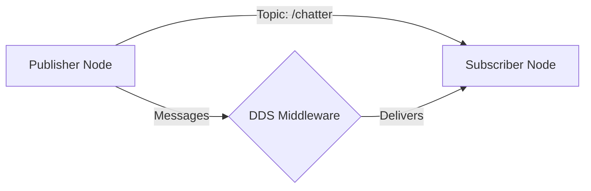

# Data Model: Chapter Content Structure

**Feature**: 003-ros2-chapter-content
**Date**: 2025-12-04
**Purpose**: Define the structure and organization of educational content entities

## Content Entities

### 1. Chapter Document

**Definition**: The complete Chapter 1 markdown file containing all educational content

**Attributes**:
- `filepath`: `docs/module-01-robotic-nervous-system/01-what-is-ros2.md`
- `frontmatter`: YAML metadata block
- `sections`: Ordered list of content sections
- `word_count`: Target 4500-6000 words
- `reading_time`: Calculated from word count

**Frontmatter Schema**:
```yaml
title: string (required) - Display title
sidebar_label: string (required) - Sidebar text
sidebar_position: number (required) - Order in sidebar
description: string (required) - SEO description
tags: array<string> (required) - Categorization tags
keywords: array<string> (required) - SEO keywords
difficulty: enum[beginner, intermediate, advanced] (required)
estimated_time: string (required) - e.g., "45-60 minutes"
prerequisites: array<string> (optional) - Required background
```

**Validation Rules**:
- Title must match "What is ROS 2?" or variation
- Word count between 4500-6000
- All frontmatter fields present
- Two main sections: "Full Lesson" and "Summary"

**Relationships**:
- Contains: Multiple ContentSection entities
- Contains: Multiple CodeExample entities
- Contains: Multiple MultimediaEmbed entities
- Contains: Multiple Exercise entities

---

### 2. ContentSection

**Definition**: A major organizational unit within the chapter (e.g., Full Lesson, Summary)

**Attributes**:
- `heading`: Section title (H2 level)
- `content`: Markdown text content
- `subsections`: Optional nested sections
- `order`: Position in document
- `section_type`: enum[full_lesson, summary, prerequisites, introduction]

**Full Lesson Structure**:
```
## Full Lesson

### What is ROS 2?
- Definition and purpose
- History and evolution
- Ecosystem overview

### Why ROS 2 Matters
- Real-world applications
- Industry adoption
- Advantages over alternatives

### Core Concepts
- Nodes
- Topics (publish-subscribe)
- Services (request-response)
- Actions (long-running tasks)

### Understanding DDS
- What is DDS?
- Role in ROS 2
- Middleware abstraction

### Quality of Service (QoS)
- QoS policies
- Reliability vs best-effort
- Durability and lifespan

### ROS 2 vs ROS 1
- Key differences
- Migration considerations
- When to use each

### ROS 2 Tools
- ros2 CLI commands
- rqt (GUI tools)
- RViz2 (visualization)

### Your First ROS 2 System
- Simple publisher/subscriber
- Seeing communication in action
```

**Summary Structure**:
```
## Summary

### Key Concepts
- Bulleted recap of main ideas

### Essential Commands
- Common ros2 CLI commands

### Quick Reference
- Topic commands
- Node commands
- Service commands

### Next Steps
- Link to next chapter
- Additional resources
```

**Validation Rules**:
- Full Lesson: 4000-5500 words
- Summary: 500-800 words (1-2 pages)
- Heading levels follow hierarchy (H2 → H3 → H4)
- No orphan sections (must have content)

---

### 3. CodeExample

**Definition**: Executable code snippet demonstrating a ROS 2 concept

**Attributes**:
- `language`: enum[python, cpp, bash] (primary: python)
- `code`: Source code text
- `description`: Explanation of what code does
- `inline_comments`: Boolean (must be true)
- `tested`: Boolean (must be true before publication)
- `filename`: Suggested save name (e.g., `publisher_demo.py`)

**Code Block Template**:
````markdown
```python
#!/usr/bin/env python3
"""
Description: [What this code does]
Prerequisites: [Required ROS 2 packages]
"""

import rclpy
from rclpy.node import Node
from std_msgs.msg import String

class MinimalPublisher(Node):
    """
    A simple publisher node that sends messages.
    """
    def __init__(self):
        super().__init__('minimal_publisher')
        # Create publisher on 'topic' with queue size 10
        self.publisher = self.create_publisher(String, 'topic', 10)

        # Create timer to publish every 0.5 seconds
        timer_period = 0.5
        self.timer = self.create_timer(timer_period, self.timer_callback)
        self.i = 0

    def timer_callback(self):
        """Callback function to publish messages."""
        msg = String()
        msg.data = f'Hello World: {self.i}'
        self.publisher.publish(msg)
        self.get_logger().info(f'Publishing: "{msg.data}"')
        self.i += 1

def main(args=None):
    rclpy.init(args=args)
    minimal_publisher = MinimalPublisher()
    rclpy.spin(minimal_publisher)
    minimal_publisher.destroy_node()
    rclpy.shutdown()

if __name__ == '__main__':
    main()
```

**To run this example**:
```bash
# Save as publisher_demo.py
# Make executable
chmod +x publisher_demo.py

# Run the node
ros2 run <package_name> publisher_demo.py

# Or run directly
python3 publisher_demo.py
```
````

**Validation Rules**:
- All code must execute without errors in ROS 2 Humble
- Comments explain non-obvious logic
- Follows PEP 8 (Python) or Google style (C++)
- Includes instructions for running
- No hardcoded paths or sensitive data

**Relationships**:
- Belongs to: ContentSection
- May reference: Other CodeExamples

---

### 4. MultimediaEmbed

**Definition**: Video, presentation, or diagram embedded in the chapter

**Attributes**:
- `media_type`: enum[video, presentation, diagram]
- `source`: URL or relative path
- `title`: Descriptive title
- `description`: What the media illustrates
- `duration`: Video length (if video)
- `alt_text`: Text alternative for accessibility

**Video Embed Template**:
```markdown
### Video: Introduction to ROS 2

<iframe width="560" height="315"
  src="https://www.youtube.com/embed/VIDEO_ID"
  title="ROS 2 Introduction"
  frameborder="0"
  allow="accelerometer; autoplay; clipboard-write; encrypted-media; gyroscope; picture-in-picture"
  allowfullscreen>
</iframe>

*Alternative*: [Watch on YouTube](https://youtube.com/watch?v=VIDEO_ID)

**Key Points from Video**:
- Point 1
- Point 2
- Point 3
```

**Presentation Link Template**:
```markdown
### Presentation: ROS 2 Architecture

📊 [View Slides: ROS 2 Architecture](https://docs.google.com/presentation/d/PRESENTATION_ID)

**Slide Highlights**:
- Slide 3: Computational graph diagram
- Slide 7: DDS middleware layer
- Slide 12: QoS policy comparison
```

**Diagram Template** (Mermaid):
````markdown
### Diagram: ROS 2 Communication



**Diagram Explanation**: Shows how publisher and subscriber nodes communicate through topics via the DDS middleware layer.
````

**Validation Rules**:
- Videos < 15 minutes preferred
- All embeds have text alternatives
- Links tested and active
- Diagrams render correctly in Docusaurus

**Relationships**:
- Belongs to: ContentSection
- Supplements: Specific concept explanation

---

### 5. Exercise

**Definition**: Hands-on activity for readers to practice concepts

**Attributes**:
- `difficulty`: enum[beginner, intermediate, advanced, challenge]
- `estimated_time`: Duration in minutes
- `goal`: What reader will accomplish
- `prerequisites`: Required knowledge/setup
- `tasks`: Step-by-step instructions
- `validation`: Success criteria checklist
- `solution_link`: Reference implementation (optional)

**Exercise Template**:
```markdown
### Exercise: Create Your First Publisher

**Difficulty**: Beginner
**Estimated Time**: 10-15 minutes
**Goal**: Create a ROS 2 node that publishes messages to a topic

**Prerequisites**:
- ROS 2 Humble installed
- Basic Python knowledge
- Completed "What is ROS 2?" reading

**Tasks**:
1. Create a new Python file called `my_publisher.py`
2. Import required ROS 2 libraries
3. Define a MinimalPublisher class
4. Implement a timer callback to publish messages
5. Run your node and observe output

**Validation Checklist**:
- [ ] Node starts without errors
- [ ] Messages appear in terminal
- [ ] `ros2 topic list` shows your topic
- [ ] `ros2 topic echo /your_topic` displays messages

**Hints**:
- Use `std_msgs/String` for simple text messages
- Set a timer period of 1.0 seconds for easy observation
- Check logs with `ros2 node info /your_node_name`

**Solution**: [View reference implementation](../solutions/01-first-publisher.py)
```

**Validation Rules**:
- Clear, achievable goal stated
- Tasks are sequential and numbered
- Validation criteria are checkboxes
- Difficulty matches actual complexity

**Relationships**:
- Belongs to: ContentSection
- Follows: Relevant concept explanation
- Uses: Related CodeExamples

---

## Content Flow Model

```
Chapter Document
├── Frontmatter (metadata)
├── Section: Full Lesson
│   ├── Subsection: What is ROS 2?
│   │   ├── Text content
│   │   └── MultimediaEmbed: Intro video
│   ├── Subsection: Core Concepts
│   │   ├── Text content
│   │   ├── Diagram: Pub-Sub pattern
│   │   └── CodeExample: Simple publisher
│   ├── Subsection: ROS 2 vs ROS 1
│   │   ├── Text content
│   │   └── MultimediaEmbed: Comparison slides
│   ├── Subsection: ROS 2 Tools
│   │   ├── Text content
│   │   └── CodeExample: CLI commands
│   └── Exercise: First ROS 2 System
└── Section: Summary
    ├── Key Concepts (bullets)
    ├── Essential Commands (table)
    └── Quick Reference (links)
```

## State Model

### Content Development States

1. **Outlined**: Structure defined, headings in place
2. **Drafted**: Text content written
3. **Code Complete**: All examples developed and tested
4. **Multimedia Integrated**: Videos/slides embedded
5. **Summary Created**: Summary section written
6. **Reviewed**: Technical review completed
7. **Polished**: Final formatting and edits
8. **Published**: Live in documentation

### Validation States

- **Draft**: May have placeholders, not validated
- **Review Ready**: All content present, needs review
- **Approved**: Passes technical review
- **Production**: Published and accessible

## File Organization

```
docs/module-01-robotic-nervous-system/
├── 01-what-is-ros2.md                    # Main chapter file
├── solutions/
│   ├── 01-first-publisher.py             # Exercise solutions
│   ├── 02-first-subscriber.py
│   └── 03-publisher-subscriber-pair.py
└── assets/
    ├── diagrams/
    │   ├── ros2-architecture.svg
    │   └── pubsub-pattern.svg
    └── presentations/
        └── ros2-overview-slides.pdf      # Backup if needed
```

## Quality Metrics

**Content Quality**:
- Readability score: 60-70 (undergraduate level)
- Code coverage: 100% of concepts have examples
- Multimedia density: 1 embed per 1000 words
- Exercise ratio: 1 exercise per major concept section

**Technical Quality**:
- Code test pass rate: 100%
- Link validity: 100%
- Multimedia load success: 100%
- Markdown lint: 0 errors

**User Experience**:
- Reading time: 45-75 minutes
- Exercise completion rate: >90% (target)
- Summary recall: >80% (target)
- User satisfaction: >4.0/5.0 (target)
