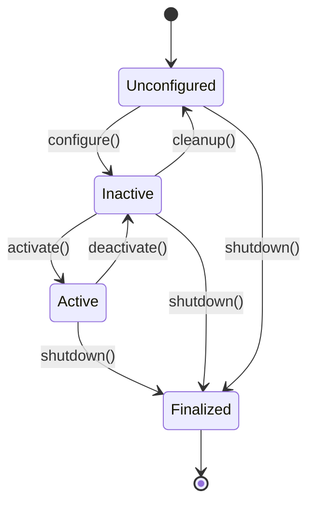
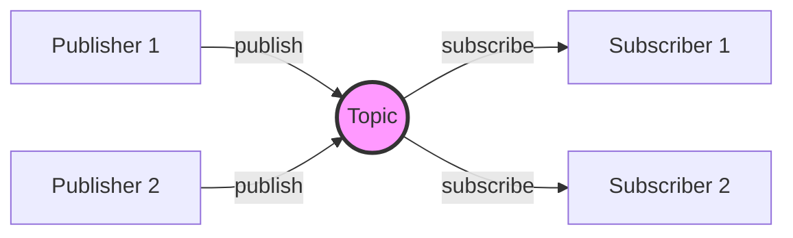
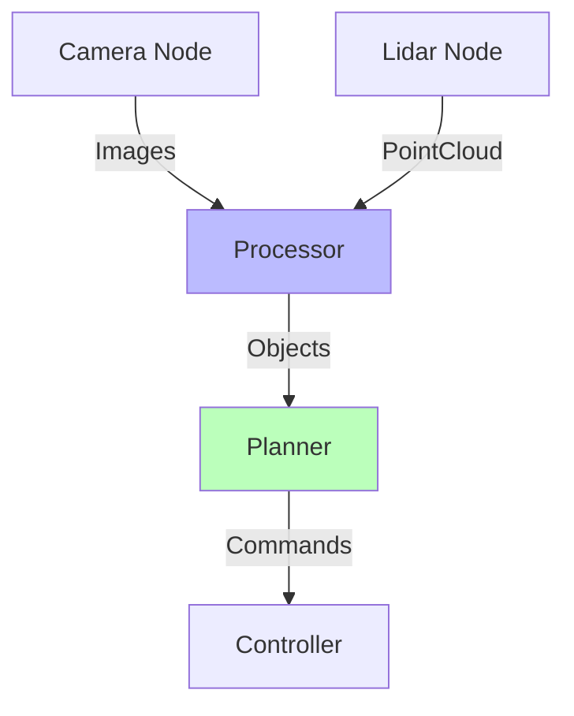
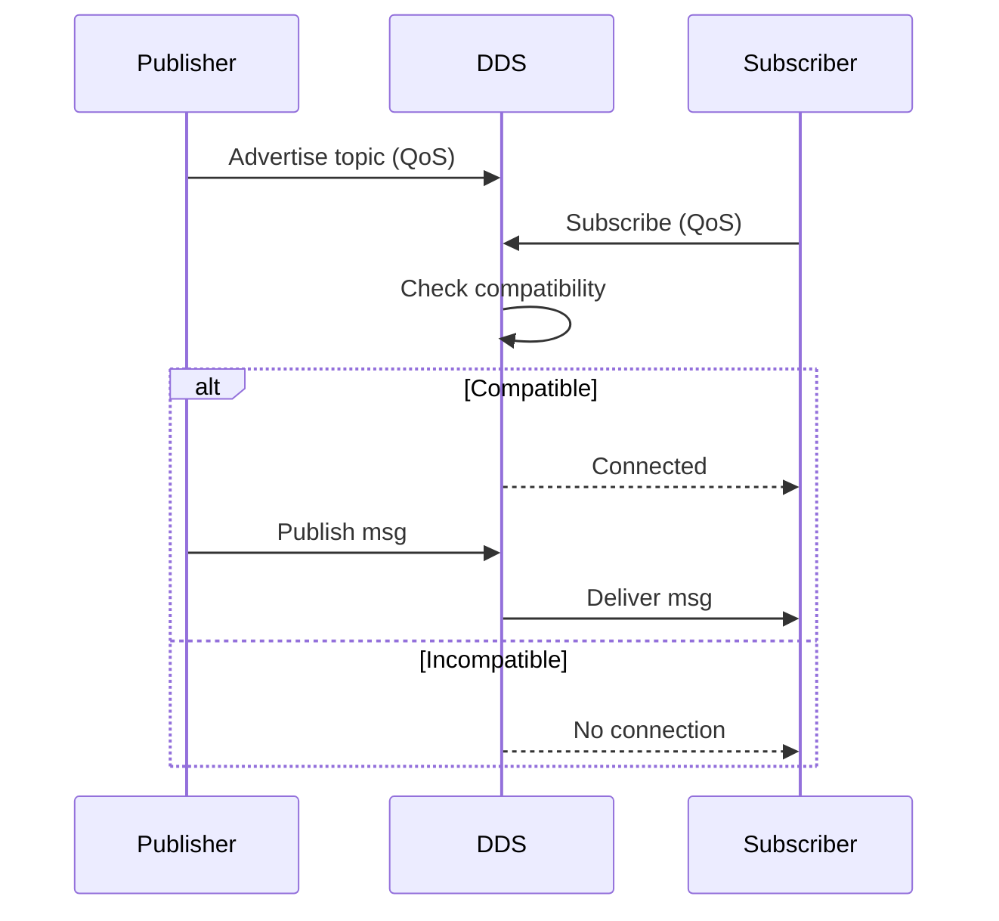

# Chapter 2 Implementation Quickstart

**Date**: 2025-12-05
**Purpose**: Quick reference for implementing Chapter 2 content
**Target File**: `docs/module-01-robotic-nervous-system/02-nodes-and-topics.md`

## Writing Workflow

Follow this workflow for each content section:

1. **Create Section Outline** from `data-model.md`
   - Copy section structure with word count targets
   - Identify functional requirements to satisfy

2. **Write Learning Objectives** (if applicable)
   - Clear, actionable, measurable objectives
   - Use Bloom's taxonomy verbs: understand, create, configure, debug, design

3. **Draft Explanatory Content** (Concept → Diagram → Example)
   - **Concept**: Plain language explanation (what + why)
   - **Diagram**: Visual representation (Mermaid or screenshot)
   - **Example**: Code or command demonstrating concept

4. **Add Code Examples** with inline comments
   - Follow code template below
   - Comment density: 1 comment per 2-3 lines
   - Include expected output

5. **Write Hands-On Exercise** (if applicable)
   - Clear objective
   - Step-by-step instructions
   - Expected outcome
   - Difficulty + time estimate

6. **Add to Summary Section**
   - Key concept bullets
   - Command reference
   - Code template

7. **Test All Code Examples** in ROS 2 Humble
   - Verify execution without errors
   - Capture actual output
   - Update expected output if needed

8. **Review Against Constitution**
   - Beginner clarity: Terms defined, progressive complexity
   - Practical application: Code tested, exercises reinforcing concepts
   - Content-first: No filler, serves learning objectives

---

## Code Example Template

### Python Publisher Template

```python
#!/usr/bin/env python3
"""
Brief description of what this node does.
"""

import rclpy
from rclpy.node import Node
from std_msgs.msg import String  # Import appropriate message type


class MinimalPublisher(Node):
    """
    Publisher node that [brief description of function].
    """

    def __init__(self):
        super().__init__('minimal_publisher')  # Node name

        # Create publisher: (message_type, topic_name, queue_size)
        self.publisher_ = self.create_publisher(String, '/chatter', 10)

        # Create timer: publish every 0.1 seconds (10 Hz)
        self.timer = self.create_timer(0.1, self.timer_callback)

        self.counter = 0  # Message counter
        self.get_logger().info('Publisher node started')

    def timer_callback(self):
        """
        Timer callback: called every 0.1 seconds to publish a message.
        """
        msg = String()  # Create message instance
        msg.data = f'Hello ROS 2: {self.counter}'  # Set message data

        self.publisher_.publish(msg)  # Publish message to topic
        self.get_logger().info(f'Publishing: "{msg.data}"')  # Log output

        self.counter += 1  # Increment counter


def main(args=None):
    rclpy.init(args=args)  # Initialize ROS 2 Python client library

    node = MinimalPublisher()  # Create node instance

    try:
        rclpy.spin(node)  # Keep node running until interrupted
    except KeyboardInterrupt:
        pass

    node.destroy_node()  # Clean up node
    rclpy.shutdown()  # Shutdown ROS 2 Python client library


if __name__ == '__main__':
    main()
```

**Expected Output**:
```
[INFO] [minimal_publisher]: Publisher node started
[INFO] [minimal_publisher]: Publishing: "Hello ROS 2: 0"
[INFO] [minimal_publisher]: Publishing: "Hello ROS 2: 1"
[INFO] [minimal_publisher]: Publishing: "Hello ROS 2: 2"
...
```

---

### Python Subscriber Template

```python
#!/usr/bin/env python3
"""
Brief description of what this node does.
"""

import rclpy
from rclpy.node import Node
from std_msgs.msg import String


class MinimalSubscriber(Node):
    """
    Subscriber node that [brief description of function].
    """

    def __init__(self):
        super().__init__('minimal_subscriber')  # Node name

        # Create subscription: (message_type, topic_name, callback, queue_size)
        self.subscription = self.create_subscription(
            String,
            '/chatter',
            self.listener_callback,
            10
        )

        self.get_logger().info('Subscriber node started')

    def listener_callback(self, msg):
        """
        Callback function: called whenever a message is received on the topic.

        Args:
            msg: The received message (String type)
        """
        self.get_logger().info(f'Received: "{msg.data}"')  # Log received message


def main(args=None):
    rclpy.init(args=args)

    node = MinimalSubscriber()

    try:
        rclpy.spin(node)
    except KeyboardInterrupt:
        pass

    node.destroy_node()
    rclpy.shutdown()


if __name__ == '__main__':
    main()
```

**Expected Output** (when publisher running):
```
[INFO] [minimal_subscriber]: Subscriber node started
[INFO] [minimal_subscriber]: Received: "Hello ROS 2: 0"
[INFO] [minimal_subscriber]: Received: "Hello ROS 2: 1"
[INFO] [minimal_subscriber]: Received: "Hello ROS 2: 2"
...
```

---

### C++ Publisher Template

```cpp
/**
 * @file minimal_publisher.cpp
 * @brief Brief description of what this node does
 */

#include <chrono>
#include <memory>
#include <string>

#include "rclcpp/rclcpp.hpp"
#include "std_msgs/msg/string.hpp"

using namespace std::chrono_literals;  // For time literals like 100ms

/**
 * @class MinimalPublisher
 * @brief Publisher node that [brief description]
 */
class MinimalPublisher : public rclcpp::Node
{
public:
  MinimalPublisher()
  : Node("minimal_publisher"), counter_(0)  // Initialize node and counter
  {
    // Create publisher: topic name, queue size
    publisher_ = this->create_publisher<std_msgs::msg::String>("/chatter", 10);

    // Create timer: call timer_callback every 100ms (10 Hz)
    timer_ = this->create_wall_timer(
      100ms, std::bind(&MinimalPublisher::timer_callback, this));

    RCLCPP_INFO(this->get_logger(), "Publisher node started");
  }

private:
  /**
   * @brief Timer callback: publishes a message every 100ms
   */
  void timer_callback()
  {
    auto msg = std_msgs::msg::String();  // Create message
    msg.data = "Hello ROS 2: " + std::to_string(counter_);  // Set data

    publisher_->publish(msg);  // Publish to topic
    RCLCPP_INFO(this->get_logger(), "Publishing: '%s'", msg.data.c_str());

    counter_++;
  }

  rclcpp::Publisher<std_msgs::msg::String>::SharedPtr publisher_;
  rclcpp::TimerBase::SharedPtr timer_;
  size_t counter_;
};

int main(int argc, char * argv[])
{
  rclcpp::init(argc, argv);  // Initialize ROS 2

  auto node = std::make_shared<MinimalPublisher>();  // Create node
  rclcpp::spin(node);  // Keep node running

  rclcpp::shutdown();  // Cleanup
  return 0;
}
```

---

## Diagram Templates

### Mermaid State Diagram (Node Lifecycle)

```markdown

\```
```

### Mermaid Flowchart (Publish-Subscribe Pattern)

```markdown

\```
```

### Mermaid Graph (Multi-Node System)

```markdown

\```
```

### Mermaid Sequence Diagram (QoS Flow)

```markdown

\```
```

---

## Quality Checklist

Before marking a section complete, verify:

### Content Quality
- [ ] **Technical term defined on first use?**
  - Check: Each ROS 2-specific term (node, topic, QoS, callback, etc.) defined when introduced
  - Fix: Add definition or link to glossary

- [ ] **Plain language before jargon?**
  - Check: Concepts explained intuitively before technical terms
  - Fix: Add analogy or real-world example

- [ ] **Logical progression?**
  - Check: Content builds from simple to complex
  - Fix: Reorder sections, add transitions

### Code Quality
- [ ] **Code example tested and functional?**
  - Check: Run in ROS 2 Humble, verify no errors
  - Fix: Debug and correct code

- [ ] **Expected output provided?**
  - Check: Sample output shown after code
  - Fix: Run code, capture output, add to text

- [ ] **Comments explain WHY, not WHAT?**
  - Check: Comments provide insight, not repetition
  - Fix: Rewrite comments to explain rationale

- [ ] **Comment density appropriate? (1:3 ratio for beginners)**
  - Check: ~1 comment per 2-3 lines of meaningful code
  - Fix: Add explanatory comments for complex lines

### Visual Quality
- [ ] **Diagram supports understanding?**
  - Check: Diagram clarifies concept better than text alone
  - Fix: Simplify diagram, add labels, or create new diagram

- [ ] **Diagram has alt text? (for accessibility)**
  - Check: Mermaid or image has descriptive text
  - Fix: Add alt attribute or caption

### Exercise Quality
- [ ] **Exercise reinforces concept?**
  - Check: Exercise requires applying learned concept
  - Fix: Redesign exercise to align with learning objective

- [ ] **Clear objective and expected outcome?**
  - Check: Learner knows what to achieve and how to verify
  - Fix: Add "Expected Outcome" section

- [ ] **Difficulty and time estimate provided?**
  - Check: Labeled as Beginner/Intermediate/Advanced with time
  - Fix: Add difficulty level and estimated completion time

### Summary Quality
- [ ] **Summary section updated?**
  - Check: Key concepts added to summary
  - Fix: Add bullet points or code template to summary

---

## Front Matter Template

Every chapter file should start with YAML front matter:

```yaml
---
title: "Nodes and Topics"
sidebar_label: "Nodes and Topics"
sidebar_position: 2
description: "Deep dive into ROS 2 nodes and asynchronous topic communication"
tags: [ros2, nodes, topics, pub-sub, communication, qos, debugging]
keywords: [ROS 2 nodes, topics, publisher, subscriber, message types, QoS policies, rqt_graph, debugging]
difficulty: beginner
estimated_time: "45-75 minutes"
prerequisites:
  - "Chapter 1: What is ROS 2?"
  - "ROS 2 Humble installation"
  - "Basic Python or C++ knowledge"
learning_objectives:
  - "Understand ROS 2 node architecture and lifecycle"
  - "Create publisher and subscriber nodes"
  - "Work with standard and custom message types"
  - "Configure QoS policies for reliable communication"
  - "Debug multi-node systems with ROS 2 tools"
  - "Design multi-node architectures using common patterns"
---
```

---

## Package Structure References

### Python Package (Recommended for Beginners)

```
my_ros_package/
├── package.xml              # ROS package metadata
├── setup.py                 # Python package setup
├── setup.cfg                # Python package configuration
├── my_ros_package/
│   ├── __init__.py
│   ├── publisher_node.py   # Publisher implementation
│   └── subscriber_node.py  # Subscriber implementation
├── msg/                     # Custom messages (optional)
│   └── CustomMsg.msg
├── resource/
│   └── my_ros_package       # Empty marker file
└── test/
    └── test_nodes.py        # Unit tests (optional)
```

### C++ Package

```
my_ros_package/
├── package.xml
├── CMakeLists.txt
├── include/
│   └── my_ros_package/
│       └── (header files)
├── src/
│   ├── publisher_node.cpp
│   └── subscriber_node.cpp
├── msg/
│   └── CustomMsg.msg
└── test/
    └── (test files)
```

---

## Common Commands Reference

### Development Commands
```bash
# Create package (Python)
ros2 pkg create --build-type ament_python my_package

# Create package (C++)
ros2 pkg create --build-type ament_cmake my_package

# Build workspace
colcon build

# Build specific package
colcon build --packages-select my_package

# Source workspace
source install/setup.bash

# Run node
ros2 run package_name node_name
```

### Debugging Commands
```bash
# List nodes
ros2 node list

# Node info
ros2 node info /node_name

# List topics
ros2 topic list

# Topic info
ros2 topic info /topic_name

# Echo messages
ros2 topic echo /topic_name

# Measure rate
ros2 topic hz /topic_name

# Publish manually
ros2 topic pub /topic_name std_msgs/msg/String "{data: 'test'}"

# Show message definition
ros2 interface show std_msgs/msg/String

# Visualize graph
rqt_graph
```

---

## Writing Tips

1. **Progressive Disclosure**: Introduce concepts in layers
   - Foundation: What is it? Why does it matter?
   - Mechanics: How does it work?
   - Implementation: How do I code it?
   - Application: How do I use it in real systems?

2. **Analogies for Abstract Concepts**
   - Publish-Subscribe: Radio broadcast
   - Topics: TV channels
   - QoS: Postal service options (priority mail vs regular)
   - Nodes: Workers in a factory

3. **Code Before Explanation (Sometimes)**
   - For simple concepts, show code first, explain after
   - For complex concepts, explain first, show code after

4. **One Concept Per Section**
   - Don't introduce multiple new concepts simultaneously
   - Build incrementally

5. **Recap and Preview**
   - End sections with "In this section, you learned..."
   - Start sections with "Now that you understand X, let's explore Y..."

6. **Real-World Context**
   - Connect concepts to actual robot applications
   - Example: "In a mobile robot, the camera node publishes images to /camera/image_raw..."

---

## Word Count Guidelines

- **Paragraph**: 50-150 words (3-7 sentences)
- **Section**: 150-300 words (2-4 paragraphs)
- **Subsection**: 800-1000 words (5-7 sections)
- **Code Example**: Doesn't count toward word total
- **Diagrams**: Doesn't count toward word total

**Balance**: Aim for 60% text, 40% code/diagrams for hands-on feel

---

## Next Steps After Creating Content

1. **Self-Review**: Use Quality Checklist above
2. **Test All Code**: Verify in ROS 2 Humble environment
3. **Peer Review**: Have another developer review for clarity
4. **Beginner Test**: Have someone unfamiliar with ROS 2 try to follow
5. **Final Polish**: Grammar, formatting, consistency check

**Ready for Implementation!** Use this quickstart as reference while writing Chapter 2 content.
