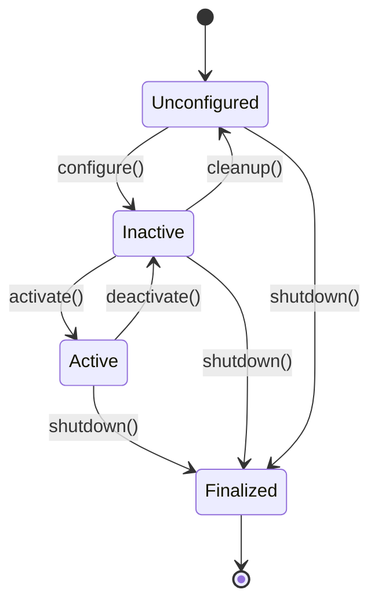
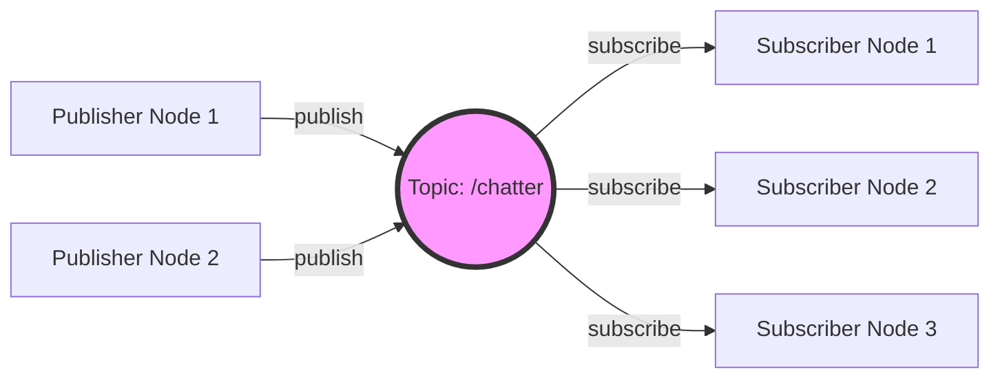
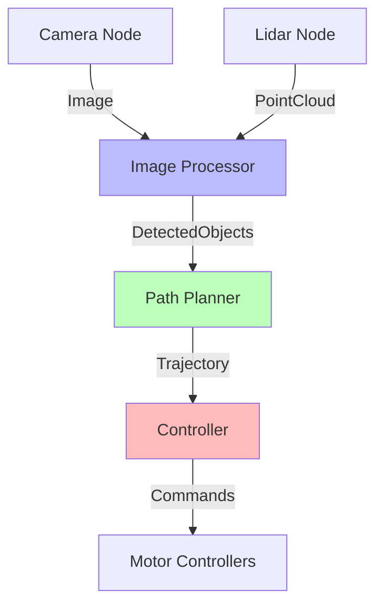
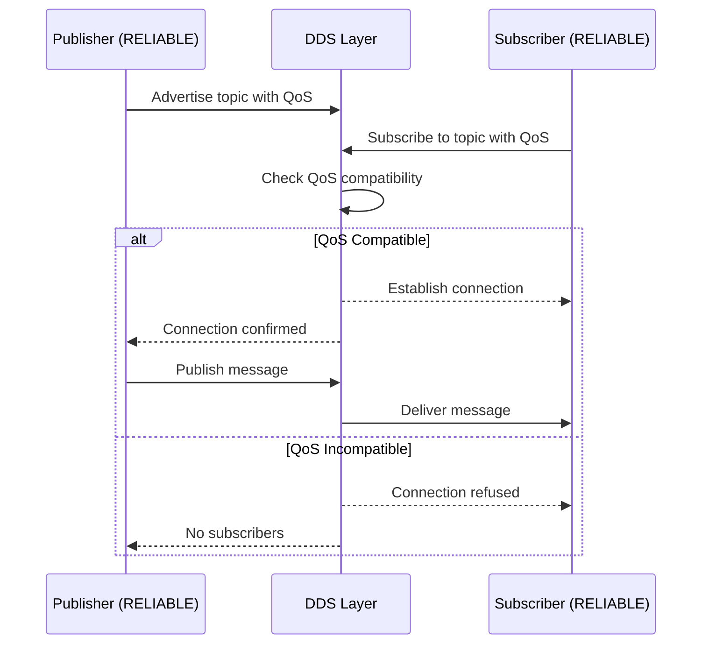

# Research: Chapter 2 - Nodes & Topics

**Date**: 2025-12-05
**Purpose**: Research ROS 2 technical concepts, pedagogical patterns, and design best practices for creating comprehensive educational content

## Section 1: ROS 2 Node Lifecycle States

**Source**: ROS 2 Design Documentation (https://design.ros2.org/articles/node_lifecycle.html)

### Lifecycle States (Managed Nodes)

ROS 2 supports **managed nodes** with defined lifecycle states, enabling deterministic startup/shutdown:

1. **Unconfigured** (Initial State)
   - Node exists but not configured
   - Transition: `configure()` → Inactive

2. **Inactive** (Configured but not running)
   - Resources allocated, node configured
   - Transition: `activate()` → Active
   - Transition: `cleanup()` → Unconfigured

3. **Active** (Fully operational)
   - Node executing its primary function
   - Publishing/subscribing actively
   - Transition: `deactivate()` → Inactive
   - Transition: `shutdown()` → Finalized

4. **Finalized** (Terminal state)
   - Node shutting down, releasing resources
   - No further transitions

### Lifecycle Transitions

- **configure**: Load configuration, allocate resources
- **cleanup**: Release resources, return to unconfigured
- **activate**: Start execution (timers, callbacks)
- **deactivate**: Pause execution, retain resources
- **shutdown**: Terminal cleanup

### Standard (Non-Managed) Nodes

Most beginner nodes are **non-managed** (simple nodes):
- Initialize directly to "Active" equivalent
- No explicit lifecycle management
- Simpler for learning basics

**Pedagogical Decision**: Chapter 2 will introduce lifecycle conceptually but focus on non-managed nodes for code examples. Managed lifecycle is Chapter 4+ material.

### Diagram Specification (Mermaid)



## Section 2: QoS Policy Decision Matrix

**Source**: ROS 2 QoS Documentation, DDS Specification

### QoS Policies Overview

Quality of Service policies control communication reliability and performance:

| Policy | Options | Use Case |
|--------|---------|----------|
| **Reliability** | RELIABLE, BEST_EFFORT | Message delivery guarantee |
| **Durability** | TRANSIENT_LOCAL, VOLATILE | Late-joining subscriber support |
| **History** | KEEP_LAST(n), KEEP_ALL | Message queue management |
| **Deadline** | Duration | Maximum time between messages |
| **Lifespan** | Duration | Message expiration time |
| **Liveliness** | AUTOMATIC, MANUAL_BY_TOPIC | Participant aliveness detection |

### Scenario-to-Profile Mapping

| Scenario | Reliability | Durability | History | Rationale |
|----------|-------------|------------|---------|-----------|
| **Sensor Data** (e.g., camera, lidar) | BEST_EFFORT | VOLATILE | KEEP_LAST(1) | High-frequency, tolerate occasional loss, only latest matters |
| **Command/Control** (e.g., motor commands) | RELIABLE | VOLATILE | KEEP_LAST(10) | Commands must arrive, but old commands not useful |
| **State Information** (e.g., robot pose) | RELIABLE | TRANSIENT_LOCAL | KEEP_LAST(1) | Late joiners need latest state immediately |
| **Log Messages** | BEST_EFFORT | VOLATILE | KEEP_LAST(100) | Logs can be lost, recent history useful |
| **Critical Safety Messages** | RELIABLE | TRANSIENT_LOCAL | KEEP_ALL | Cannot lose messages, all must be processed |
| **Configuration Data** | RELIABLE | TRANSIENT_LOCAL | KEEP_LAST(1) | Late joiners need config, only latest version matters |

### QoS Compatibility Rules

For communication to work, publisher and subscriber QoS must be **compatible**:

- **Reliability**: RELIABLE publisher can match RELIABLE or BEST_EFFORT subscriber
- **Durability**: TRANSIENT_LOCAL publisher can match TRANSIENT_LOCAL or VOLATILE subscriber
- **History**: Any combination compatible (independent setting)

**Incompatibility Example**: BEST_EFFORT publisher + RELIABLE subscriber = NO CONNECTION

### Default QoS Profiles (ROS 2)

- **Default**: RELIABLE + VOLATILE + KEEP_LAST(10)
- **Sensor Data**: BEST_EFFORT + VOLATILE + KEEP_LAST(5)
- **Services**: RELIABLE + VOLATILE + KEEP_LAST(10)
- **Parameters**: RELIABLE + VOLATILE + KEEP_LAST(1000)

**Pedagogical Decision**: Teach default profile first, then show customization with sensor data and critical messages as examples.

## Section 3: Code Example Guidelines

**Source**: Chapter 1 analysis, ROS 2 tutorials, Python/C++ education best practices

### Comment Density Standards

- **Beginners (Chapter 2)**: 1 comment per 2-3 lines of meaningful code
- **Intermediate**: 1 comment per 5-7 lines
- **Comments Should Explain**:
  - **Why** (rationale), not just **what** (obvious from code)
  - ROS 2-specific concepts (topics, QoS, callbacks)
  - Non-obvious parameter choices

**Example Comment Quality**:
```python
# Good: Explains WHY and ROS concept
self.create_timer(0.1, self.timer_callback)  # Publish at 10 Hz (0.1s period)

# Bad: Repeats obvious information
self.create_timer(0.1, self.timer_callback)  # Create a timer
```

### Complexity Progression

1. **Minimal Publisher** (15-20 lines)
   - Initialize node
   - Create publisher
   - Create timer
   - Publish method

2. **Minimal Subscriber** (15-20 lines)
   - Initialize node
   - Create subscriber
   - Callback method

3. **Combined Node** (30-40 lines)
   - Publisher + Subscriber in one node
   - Data transformation example

4. **Custom Message** (40-50 lines + .msg file)
   - Define custom message
   - Package setup (package.xml, CMakeLists.txt/setup.py)
   - Publisher/subscriber using custom message

### Package Structure Template

**Python Package** (recommended for beginners):
```
my_package/
├── package.xml           # ROS package metadata
├── setup.py              # Python package setup
├── my_package/
│   ├── __init__.py
│   ├── publisher_node.py
│   └── subscriber_node.py
├── msg/                  # Custom messages (if needed)
│   └── CustomMsg.msg
└── resource/
    └── my_package
```

**C++ Package** (supplementary):
```
my_package/
├── package.xml
├── CMakeLists.txt
├── include/my_package/
├── src/
│   ├── publisher_node.cpp
│   └── subscriber_node.cpp
└── msg/
    └── CustomMsg.msg
```

**Pedagogical Decision**: Show Python package setup in detail, reference C++ setup for interested learners. Focus on minimal boilerplate.

### Code Style Standards

**Python**:
- PEP 8 compliant
- Class names: PascalCase (MinimalPublisher)
- Node names: snake_case ('minimal_publisher')
- Topic names: snake_case ('/my_topic')

**C++**:
- ROS 2 C++ style guide
- Class names: PascalCase (MinimalPublisher)
- Pointer types: Use shared_ptr for nodes
- Namespace: rclcpp::

## Section 4: Diagram Specifications

**Source**: Mermaid documentation, existing book diagrams

### Node Lifecycle Diagram (State Diagram)

**Type**: Mermaid `stateDiagram-v2`
**Purpose**: Show lifecycle transitions
**Location**: Node Architecture section
**Code**: See Section 1 above

### Publish-Subscribe Pattern (Flowchart)

**Type**: Mermaid `flowchart LR`
**Purpose**: Show data flow from publisher to subscriber via topic
**Location**: Topics & Communication section



### Multi-Node Communication (Graph)

**Type**: Mermaid `graph TD`
**Purpose**: Show complex multi-node system architecture
**Location**: System Design section



### QoS Compatibility Flow (Sequence Diagram)

**Type**: Mermaid `sequenceDiagram`
**Purpose**: Show QoS negotiation and compatibility checking
**Location**: QoS section



**Pedagogical Decision**: Use diagrams to visualize abstract concepts before showing code. All diagrams embedded in markdown using Mermaid for easy editing.

## Section 5: Multi-Node Design Patterns

**Source**: ROS 2 architectural guides, robotics system design literature

### Pattern 1: Pipeline (Sequential Processing)

**Structure**: Node A → Node B → Node C → Node D
**Use Case**: Sequential data transformation (e.g., image capture → filtering → detection → tracking)
**Advantages**:
- Clear data flow
- Easy to understand and debug
- Modular components

**Disadvantages**:
- Latency accumulates through pipeline
- Failure in one node blocks entire chain

**Example**:
```
Camera → Image Preprocessor → Object Detector → Object Tracker → Visualizer
```

### Pattern 2: Star/Hub (Central Coordinator)

**Structure**: Multiple nodes publish to/subscribe from central hub
**Use Case**: Centralized state management, data fusion
**Advantages**:
- Single source of truth
- Easy synchronization
- Simplified communication graph

**Disadvantages**:
- Hub becomes bottleneck
- Single point of failure
- Hub complexity grows with system

**Example**:
```
          Sensors → [State Estimator] → Controllers
       (camera,lidar,imu)    (hub)      (arm,base)
```

### Pattern 3: Hierarchical (Layered Architecture)

**Structure**: Layers of abstraction (perception → planning → control)
**Use Case**: Complex robot systems with separation of concerns
**Advantages**:
- Clear separation of responsibilities
- Different layers can operate at different rates
- Easier to test layers independently

**Disadvantages**:
- More complex overall architecture
- Requires careful interface design between layers

**Example**:
```
[Perception Layer] → [Planning Layer] → [Control Layer] → [Hardware Layer]
  Sensors, State       Path Planning      Controllers       Actuators
```

### Pattern 4: Peer-to-Peer (Distributed)

**Structure**: Nodes communicate directly without central coordinator
**Use Case**: Distributed systems, multi-robot coordination
**Advantages**:
- No single point of failure
- Scalable
- Flexible

**Disadvantages**:
- Complex communication graph
- Harder to debug
- Synchronization challenges

### Common Anti-Patterns to Avoid

1. **Circular Dependencies**
   - Problem: Node A depends on B, B depends on A
   - Solution: Introduce mediator or restructure data flow

2. **Topic Storm**
   - Problem: Too many topics, unclear data flow
   - Solution: Consolidate related data, use namespaces

3. **Monolithic Node**
   - Problem: Single node doing everything
   - Solution: Split by responsibility (sensing, processing, control)

4. **Tight Coupling**
   - Problem: Nodes assume specific implementation details of others
   - Solution: Design clear interfaces (message types), avoid implementation dependencies

5. **No Error Handling**
   - Problem: Nodes crash on unexpected input
   - Solution: Validate messages, handle edge cases, use QoS for reliability

**Pedagogical Decision**: Present patterns with visual diagrams and simple examples. Focus on pipeline (easiest) and hierarchical (most common in robotics). Anti-patterns as "what NOT to do" warnings.

## Section 6: Troubleshooting Common Errors

**Source**: ROS 2 community forums, typical beginner mistakes

### Error Category 1: Node Communication Failures

**Error**: "No publishers/subscribers found"
**Causes**:
- Topic name mismatch (typo, wrong namespace)
- Node not running
- QoS incompatibility

**Debugging**:
```bash
ros2 topic list              # Verify topic exists
ros2 topic info /topic_name  # Check publishers/subscribers
ros2 node list               # Verify nodes are running
```

**Solution**: Check topic names, verify QoS compatibility

### Error Category 2: Build Errors (Custom Messages)

**Error**: "Could not find message definition"
**Causes**:
- Missing dependency in package.xml
- CMakeLists.txt not configured for messages
- Workspace not sourced after build

**Debugging**:
```bash
colcon build                    # Check build output
source install/setup.bash       # Source workspace
ros2 interface list | grep Msg  # Verify message available
```

**Solution**: Update package.xml, add rosidl dependencies, rebuild

### Error Category 3: Import Errors (Python)

**Error**: "ModuleNotFoundError: No module named 'rclpy'"
**Causes**:
- ROS 2 environment not sourced
- Wrong Python interpreter
- Package not installed

**Debugging**:
```bash
source /opt/ros/humble/setup.bash   # Source ROS 2
python3 -c "import rclpy"            # Test import
```

**Solution**: Source ROS 2 environment in every terminal

### Error Category 4: Runtime Crashes

**Error**: "Segmentation fault" or "Node crashed"
**Causes**:
- Accessing uninitialized variables
- Null pointer dereference (C++)
- Type mismatch in message handling

**Debugging**:
- Check callback function logic
- Validate message fields before accessing
- Use try-except (Python) or proper pointer checks (C++)

**Solution**: Add defensive programming, validate inputs

### Error Category 5: Performance Issues

**Error**: "Messages dropping" or "High latency"
**Causes**:
- QoS history queue too small
- Slow callback blocking node
- Publishing rate too high for subscriber

**Debugging**:
```bash
ros2 topic hz /topic_name       # Check actual publish rate
ros2 topic delay /topic_name    # Measure latency (if available)
```

**Solution**: Adjust QoS history depth, optimize callbacks, match rates

**Pedagogical Decision**: Create troubleshooting section with most common errors. Use command-line debugging tools to diagnose. Provide before/after code examples for fixes.

## Research Summary

### Key Findings

1. **Lifecycle Management**: Introduce conceptually but focus on non-managed nodes for beginner code examples
2. **QoS Policies**: Start with defaults, show customization with 2-3 clear use cases (sensor data, commands, critical messages)
3. **Code Examples**: High comment density (1:3 ratio), progressive complexity, Python primary, C++ supplementary
4. **Diagrams**: Use Mermaid for all technical diagrams (lifecycle, pub-sub, system architecture)
5. **Design Patterns**: Focus on pipeline and hierarchical, mention peer-to-peer as advanced
6. **Troubleshooting**: Categorize by error type, provide debugging commands, show fixes

### Implementation Recommendations

- **Word Allocation**: Spend most words on code examples and QoS (complex topics)
- **Visual Aids**: Minimum 4 diagrams (lifecycle, pub-sub, multi-node, QoS)
- **Code Progression**: Simple → custom messages → QoS → multi-node
- **Hands-On Balance**: 60% reading, 40% coding/exercises
- **Difficulty Curve**: Gentle slope, lots of examples, clear explanations

### Unknowns Resolved

All research tasks complete. No remaining "NEEDS CLARIFICATION" items.

Ready to proceed to Phase 1: Design & Content Architecture.
